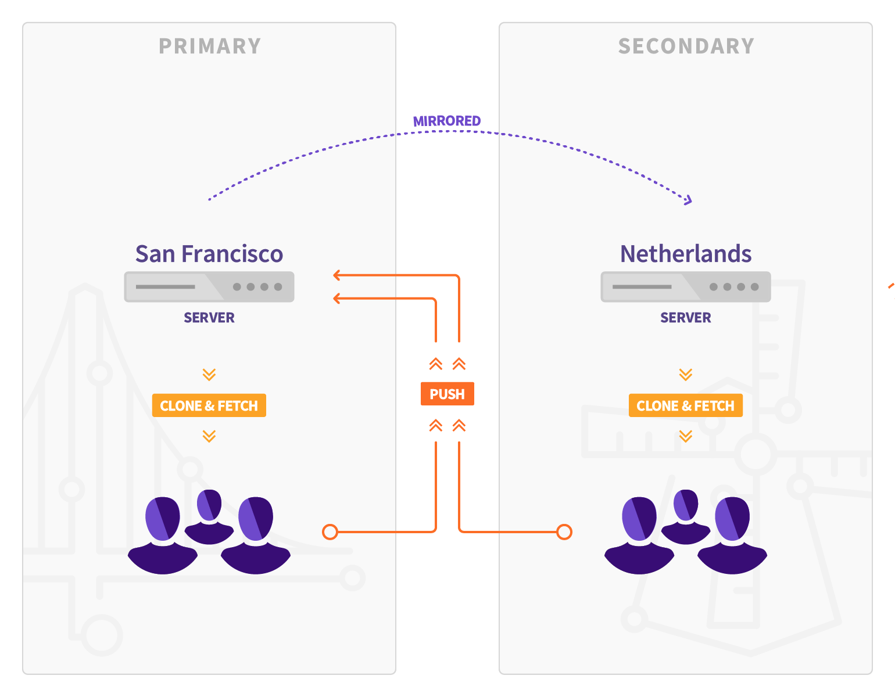
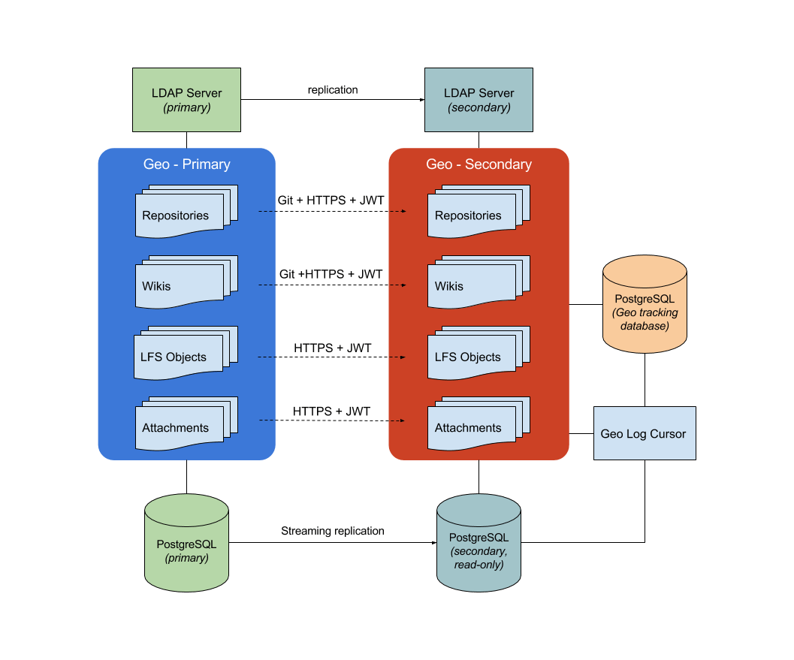

# Geo (Geo Replication) **[PREMIUM ONLY]**

> **Notes:**
- Geo is part of [GitLab Premium][ee]
- Introduced in GitLab Enterprise Edition 8.9
  We recommend you use it with at least GitLab Enterprise Edition 10.0 for
  basic Geo features, or latest version for a better experience
- You should make sure that all nodes run the same GitLab version
- Geo requires PostgreSQL 9.6 and Git 2.9 in addition to GitLab's usual
  [minimum requirements][install-requirements]
- Using Geo in combination with High Availability (HA) is considered **Generally Available** (GA) in GitLab Enterprise Edition 10.4

>**Note:**
Geo changes significantly from release to release. Upgrades **are**
supported and [documented](#updating-the-geo-nodes), but you should ensure that
you're following the right version of the documentation for your installation!
The best way to do this is to follow the documentation from the `/help` endpoint
on your **primary** node, but you can also navigate to [this page on GitLab.com](https://gitlab.com/gitlab-org/gitlab-ee/blob/master/doc/gitlab-geo/README.md)
and choose the appropriate release from the `tags` dropdown, e.g., `v10.0.0-ee`.

Geo allows you to replicate your GitLab instance to other geographical
locations as a read-only fully operational version.

## Overview

If you have two or more teams geographically spread out, but your GitLab
instance is in a single location, fetching large repositories can take a long
time.

Your Geo instance can be used for cloning and fetching projects, in addition to
reading any data. This will make working with large repositories over large
distances much faster.



When Geo is enabled, we refer to your original instance as a **primary** node
and the replicated read-only ones as **secondaries**.

Keep in mind that:

- Secondaries talk to the primary to get user data for logins (API) and to
  replicate repositories, LFS Objects and Attachments (HTTPS + JWT).
- Since GitLab Premium 10.0, the primary no longer talks to
  secondaries to notify for changes (API).

## Use-cases

- Can be used for cloning and fetching projects, in addition
to reading any data available in the GitLab web interface (see [current limitations](#current-limitations))
- Overcomes slow connection between distant offices, saving time by
improving speed for distributed teams
- Helps reducing the loading time for automated tasks,
custom integrations and internal workflows
- Quickly failover to a Geo secondary in a [Disaster Recovery][disaster-recovery] scenario
- Allows [planned failover] to a Geo secondary

## Architecture

The following diagram illustrates the underlying architecture of Geo
([source diagram]).



In this diagram, there is one Geo primary node and one secondary. The
secondary clones repositories via git over HTTPS. Attachments, LFS objects, and
other files are downloaded via HTTPS using the GitLab API to authenticate,
with a special endpoint protected by JWT.

Writes to the database and Git repositories can only be performed on the Geo
primary node. The secondary node receives database updates via PostgreSQL
streaming replication.

Note that the secondary needs two different PostgreSQL databases: a read-only
instance that streams data from the main GitLab database and another used
internally by the secondary node to record what data has been replicated.

In the secondary nodes there is an additional daemon: Geo Log Cursor.

## Geo Recommendations

We highly recommend that you install Geo on an operating system that supports
OpenSSH 6.9 or higher. The following operating systems are known to ship with a
current version of OpenSSH:

    * CentOS 7.4
    * Ubuntu 16.04

Note that CentOS 6 and 7.0 ship with an old version of OpenSSH that do not
support a feature that Geo requires. See the [documentation on Geo SSH
access][fast-ssh-lookup] for more details.

### LDAP

We recommend that if you use LDAP on your primary that you also set up a
secondary LDAP server for the secondary Geo node. Otherwise, users will not be
able to perform Git operations over HTTP(s) on the **secondary** Geo node
using HTTP Basic Authentication. However, Git via SSH and personal access
tokens will still work.

Check with your LDAP provider for instructions on on how to set up
replication. For example, OpenLDAP provides [these
instructions][ldap-replication].

### Geo Tracking Database

We use the tracking database as metadata to control what needs to be
updated on the disk of the local instance (for example, download new assets,
fetch new LFS Objects or fetch changes from a repository that has recently been
updated).

Because the replicated instance is read-only, we need this additional instance
per secondary location.

### Geo Log Cursor

This daemon reads a log of events replicated by the primary node to the secondary
database and updates the Geo Tracking Database with changes that need to be
executed.

When something is marked to be updated in the tracking database, asynchronous
jobs running on the secondary node will execute the required operations and
update the state.

This new architecture allows us to be resilient to connectivity issues between the
nodes. It doesn't matter if it was just a few minutes or days. The secondary
instance will be able to replay all the events in the correct order and get in
sync again.

## Setup instructions

These instructions assume you have a working instance of GitLab. They will
guide you through making your existing instance the primary Geo node and
adding secondary Geo nodes.

The steps below should be followed in the order they appear. **Make sure the
GitLab version is the same on all nodes.**

### Using Omnibus GitLab

If you installed GitLab using the Omnibus packages (highly recommended):

1. [Install GitLab Enterprise Edition][install-ee] on the server that will serve
   as the **secondary** Geo node. Do not create an account or login to the new
   secondary node.
1. [Upload the GitLab License][upload-license] on the **primary**
   Geo node to unlock Geo.
1. [Setup the database replication][database] (`primary (read-write) <->
   secondary (read-only)` topology).
1. [Configure fast lookup of authorized SSH keys in the database][fast-ssh-lookup],
   this step is required and needs to be done on both the primary AND secondary nodes.
1. [Configure GitLab][configuration] to set the primary and secondary nodes.
1. Optional: [Configure a secondary LDAP server][config-ldap]
   for the secondary. See [notes on LDAP](#ldap).
1. [Follow the "Using a Geo Server" guide][using-geo].

### Using GitLab installed from source

If you installed GitLab from source:

1. [Install GitLab Enterprise Edition][install-ee-source] on the server that
   will serve as the **secondary** Geo node. Do not create an account or login
   to the new secondary node.
1. [Upload the GitLab License][upload-license] on the **primary**
   Geo node to unlock Geo.
1. [Setup the database replication][database-source] (`primary (read-write)
   <-> secondary (read-only)` topology).
1. [Configure fast lookup of authorized SSH keys in the database][fast-ssh-lookup],
   do this step for both primary AND secondary nodes.
1. [Configure GitLab][configuration-source] to set the primary and secondary
   nodes.
1. [Follow the "Using a Geo Server" guide][using-geo].

## Configuring Geo

Read through the [Geo configuration][configuration] documentation.

## Updating the Geo nodes

Read how to [update your Geo nodes to the latest GitLab version][updating-geo].

## Configuring Geo HA

Read through the [Geo High Availability documentation][ha].

## Configuring Geo with Object storage

When you have object storage enabled, please consult the
[Geo with Object Storage][object-storage] documentation.

## Disaster Recovery

Read through the [Disaster Recovery documentation][disaster-recovery] how to use Geo to mitigate data-loss and
restore services in a disaster scenario.

### Replicating the Container Registry

Read how to [replicate the Container Registry][docker-registry].

## Current limitations

> **IMPORTANT**: This list of limitations tracks only the latest version. If you are in an older version,
extra limitations may be in place.

- You cannot push code to secondary nodes, see [gitlab-org/gitlab-ee#3912] for details.
- The primary node has to be online for OAuth login to happen (existing sessions and Git are not affected)
- The installation takes multiple manual steps that together can take about an hour depending on circumstances; we are
  working on improving this experience, see [gitlab-org/omnibus-gitlab#2978] for details.
- Real-time updates of issues/merge requests (e.g. via long polling) doesn't work on the secondary
- [Selective synchronization](configuration.md#selective-synchronization)
  applies only to files and repositories. Other datasets are replicated to the
  secondary in full, making it inappropriate for use as an access control
  mechanism.

### Limitations on replication

Only the following items are replicated to the secondary. Data not on this list is unavailable on the secondary. Failing over without manually replicating it will cause the data to be **lost**:

- All database content (e.g. snippets, epics, issues, merge requests, groups, project metadata, etc)
- Project repositories
- Project wiki repositories
- User uploads (e.g. attachments to issues, merge requests and epics, avatars, etc)
- CI job artifacts and traces

### Examples of unreplicated data

Take special note that these GitLab features are both commonly used, and **not**
replicated by Geo at present. If you wish to use them on the secondary, or to
execute a failover successfully, you will need to replicate their data using
some other means.

- [Elasticsearch integration](../../../integration/elasticsearch.md)
- [Container Registry](../../container_registry.md) ([Object Storage][docker-registry] can mitigate this)
- [GitLab Pages](../../pages/index.md)
- [Mattermost integration](https://docs.gitlab.com/omnibus/gitlab-mattermost/)

## Frequently Asked Questions

Read more in the [Geo FAQ][faq].

## Log files

Since GitLab 9.5, Geo stores structured log messages in a `geo.log` file. For
Omnibus installations, this file can be found in
`/var/log/gitlab/gitlab-rails/geo.log`. This file contains information about
when Geo attempts to sync repositories and files. Each line in the file contains a
separate JSON entry that can be ingested into Elasticsearch, Splunk, etc. For
example:

```json
{"severity":"INFO","time":"2017-08-06T05:40:16.104Z","message":"Repository update","project_id":1,"source":"repository","resync_repository":true,"resync_wiki":true,"class":"Gitlab::Geo::LogCursor::Daemon","cursor_delay_s":0.038}
```

This message shows that Geo detected that a repository update was needed for project 1.

## Security of Geo

Read the [security review][security-review] page.

## Tuning Geo

Read the [Geo tuning][tunning] documentation.

## Troubleshooting

Read the [troubleshooting document][troubleshooting].

[ee]: https://about.gitlab.com/products/ "GitLab Enterprise Edition landing page"
[install-requirements]: ../../../install/requirements.md
[install-ee]: https://about.gitlab.com/downloads-ee/ "GitLab Enterprise Edition Omnibus packages downloads page"
[install-ee-source]: https://docs.gitlab.com/ee/install/installation.html "GitLab Enterprise Edition installation from source"
[disaster-recovery]: ../disaster_recovery/index.md
[planned failover]: ../disaster_recovery/planned_failover.md
[fast-ssh-lookup]: ../../operations/fast_ssh_key_lookup.md
[upload-license]: ../../../user/admin_area/license.md
[database]: database.md
[database-source]: database_source.md
[configuration]: configuration.md
[configuration-source]: configuration_source.md
[config-ldap]: ../../auth/ldap.md
[using-geo]: using_a_geo_server.md
[updating-geo]: updating_the_geo_nodes.md
[ha]: high_availability.md
[object-storage]: object_storage.md
[docker-registry]: docker_registry.md
[faq]: faq.md
[security-review]: security_review.md
[tunning]: tuning.md
[troubleshooting]: troubleshooting.md
[source diagram]: https://docs.google.com/drawings/d/1Abw0P_H0Ew1-2Lj_xPDRWP87clGIke-1fil7_KQqrtE/edit
[ldap-replication]: https://www.openldap.org/doc/admin24/replication.html
[gitlab-org/gitlab-ee#3912]: https://gitlab.com/gitlab-org/gitlab-ee/issues/3912
[gitlab-org/omnibus-gitlab#2978]: https://gitlab.com/gitlab-org/omnibus-gitlab/issues/2978
