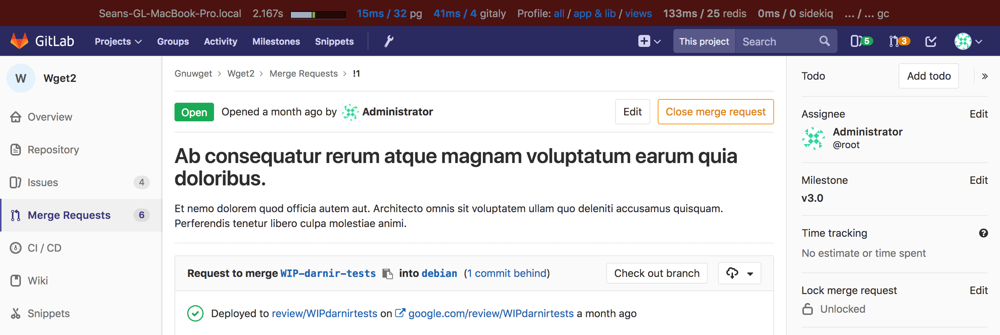

# Performance Bar

>**Note:**
Available since GitLab 9.4.

A Performance Bar can be displayed, to dig into the performance of a page. When
activated, it looks as follows:



It allows you to:

- see the current host serving the page
- see the timing of the page (backend, frontend)
- the number of DB queries, the time it took, and the detail of these queries

- the number of calls to Redis, and the time it took
- the number of background jobs created by Sidekiq, and the time it took
- the number of Ruby GC calls, and the time it took
- profile the code used to generate the page, line by line


## Enable the Performance Bar

By default, the Performance Bar is disabled. You can enable it either for a
given feature group or user.

1. Edit `/etc/gitlab/gitlab.rb`
1. Find the following line, and set it to the group's **full path** that should
be allowed to use the Performance Bar:

    ```ruby
    gitlab_rails['performance_bar_allowed_group'] = 'your-org/your-performance-group'
    ```

1. Save the file and [reconfigure GitLab][reconfigure] for the changes to
   take effect
1. The Performance Bar can then be enabled via the
   [Features API](../../../api/features.md#set-or-create-a-feature) (see below).

### Enable for the `performance_team` feature group

The `performance_team` feature group maps to the group specified by the
`performance_bar_allowed_group` setting you've set in the previous step.

```
curl --data "feature_group=performance_team" --data "value=true" --header "PRIVATE-TOKEN: 9koXpg98eAheJpvBs5tK" https://gitlab.example.com/api/v4/features/performance_bar
```

### Enable for a specific user

```
curl --data "user=my_username" --data "value=true" --header "PRIVATE-TOKEN: 9koXpg98eAheJpvBs5tK" https://gitlab.example.com/api/v4/features/performance_bar
```

[reconfigure]: ../../restart_gitlab.md#omnibus-gitlab-reconfigure
