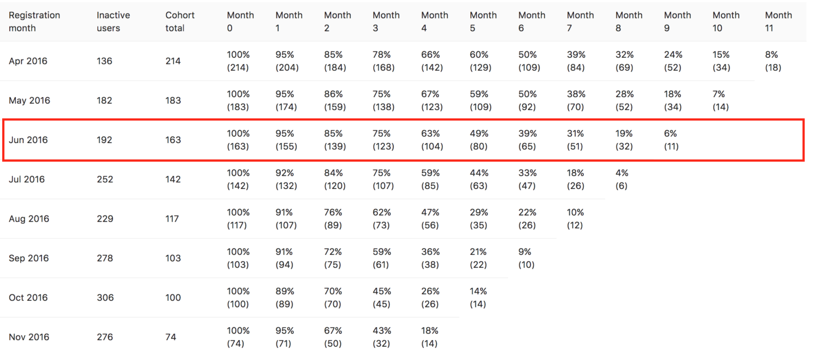

# Usage ping and cohorts

> **Notes:**
- [Introduced][ee-380] in GitLab EE 8.10 and [added to CE][ce-23361] in GitLab 9.1.

## Usage ping

In order for GitLab to become a data-driven company, where deciding what to
build next is driven by how users are using the product, GitLab needs to collect
usage data. This is done via a feature called usage ping.

Usage ping is a weekly, anonymous JSON sent to GitLab, containing several
metrics on how people use specific features.

You can see at any given point in time the content of the JSON file that will be
sent in the Administration panel of your GitLab installation. This feature can
also be deactivated at any given time.

The information that is sent contains the total number of:
* Comments
* Groups
* Users
* Projects
* Issues
* Labels
* CI builds
* Snippets
* Milestones
* Todos
* Pushes
* Merge requests
* Environments
* Triggers
* Deploy keys
* Pages
* Project Services
* Issue Boards
* CI Runners
* Deployments
* Geo Nodes
* LDAP Groups
* LDAP Keys
* LDAP Users
* LFS objects
* Protected branches
* Releases
* Remote mirrors
* Web hooks

More will be added over time. The goal of this ping is to be as light as
possible, so it won't have any performance impact on your installation when
calculation is made.

### Deactivate the usage ping

By default, usage ping is opt-out. If you want to deactivate, go to the Settings
page of your administration panel and uncheck the Usage ping checkbox.

## Cohorts

As a benefit of having the usage ping active, GitLab lets you analyze the user's
activities of your GitLab installation. Under [LINK], when the usage ping is
active, GitLab will show the monthly cohorts of new users and their activities
over time.

How do we read user cohorts table? Let's take an example with the following user
cohorts.

[IMAGE]

For the cohort of June 2016, 163 users have been created on this server. One
month after, in July 2016, 155 users (or 95% of the June cohort) are still
active. Two months after, 139 users (or 85%) are still active. 9 months after,
we can see that only 6% of this cohort are still active.

How do we measure the activity of users? GitLab considers a user active if:
* the user signs in
* the user has a git activity (wether push or pull).

### Setup

1. Activate the usage ping as defined in [LINK]
2. Go to [LINK] to see the user cohorts of the server
