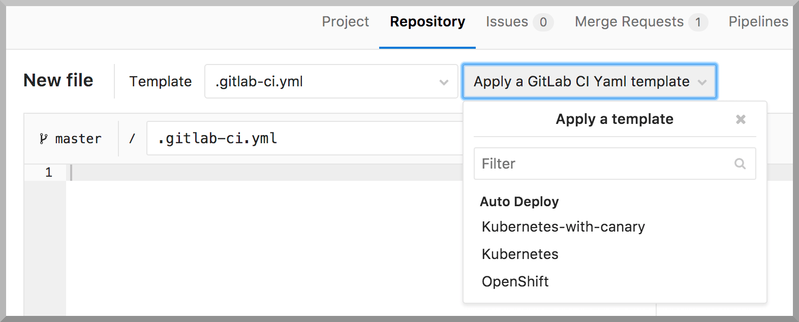

# Auto deploy

> [Introduced][mr-8135] in GitLab 8.15. Currently requires a [Public project][project-settings].

Auto deploy is an easy way to configure GitLab CI for the deployment of your
application. GitLab Community maintains a list of `.gitlab-ci.yml`
templates for various infrastructure providers and deployment scripts
powering them. These scripts are responsible for packaging your application,
setting up the infrastructure and spinning up necessary services (for
example a database).

You can use [project services][project-services] to store credentials to
your infrastructure provider and they will be available during the
deployment.

## Supported templates

The list of supported auto deploy templates is available in the
[gitlab-ci-yml project][auto-deploy-templates].

## Configuration

1. Enable a deployment [project service][project-services] to store your
credentials. For example, if you want to deploy to OpenShift you have to
enable [Kubernetes service][kubernetes-service].
1. Configure GitLab Runner to use Docker or Kubernetes executor with
[privileged mode enabled][docker-in-docker].
1. Navigate to the "Project" tab and click "Set up auto deploy" button.
   
1. Select a template.
  
1. Commit your changes and create a merge request.
1. Test your deployment configuration using a [Review App][review-app] that was
created automatically for you.

## Using the Kubernetes deploy example project with Nginx

The Autodeploy templates are based on the [kubernetes-deploy][kube-deploy]
project which is used to simplify the deployment process to Kubernetes by
providing intelligent `build`, `deploy` and `destroy` commands which you can
use in your `.gitlab-ci.yml` as-is. It uses Heroku'ish build packs to do some
of the work, plus some of GitLab's own tools to package it all up. For your
convenience, a [Docker image][kube-image] is also provided.

---

A simple example would be the deployment of Nginx on Kubernetes.
Consider a `nginx-deployment.yaml` file in your project with contents:

```yaml
apiVersion: extensions/v1beta1
kind: Deployment
metadata:
  name: __CI_ENVIRONMENT_SLUG__
  labels:
    app: __CI_ENVIRONMENT_SLUG__
    track: stable
spec:
  replicas: 3
  template:
    metadata:
      labels:
        app: __CI_ENVIRONMENT_SLUG__
        track: stable
    spec:
      containers:
      - name: nginx
        image: nginx:1.7.9
        ports:
        - containerPort: 80
```

The important part is where we set up `app: __CI_ENVIRONMENT_SLUG__`. As you'll
see later this is replaced by the [`CI_ENVIRONMENT_SLUG` env variable][variables].

The `.gitlab-ci.yml` would be:

```yaml
image: registry.gitlab.com/gitlab-examples/kubernetes-deploy

stages:
  - deploy

kubernetes deploy:
  stage: deploy
  environment:
    name: production
  script:
    - echo "$KUBE_CA_PEM" > kube_ca.pem
    - cat kube_ca.pem
    - kubectl config set-cluster default-cluster --server=$KUBE_URL --certificate-authority="$(pwd)/kube_ca.pem"
    - kubectl config set-credentials default-admin --token=$KUBE_TOKEN
    - kubectl config set-context default-system --cluster=default-cluster --user=default-admin --namespace $KUBE_NAMESPACE
    - kubectl config use-context default-system

    - sed -i "s/__CI_ENVIRONMENT_SLUG__/$CI_ENVIRONMENT_SLUG/" nginx-deployment.yaml
    - cat nginx-deployment.yaml
    - kubectl cluster-info
    - kubectl get deployments -l app=$CI_ENVIRONMENT_SLUG
    - kubectl create -f nginx-deployment.yaml || kubectl replace -f nginx-deployment.yaml
```

Notice that we use a couple of environment Kubernetes variables to configure
the Kubernetes cluster. These are exposed from the
[Kubernetes service](../../user/project/integrations/kubernetes.md#deployment-variables).
The most important one is the `$KUBE_NAMESPACE` which should be unique for
every project.

Next, we replace `__CI_ENVIRONMENT_SLUG__` with the content of the
`CI_ENVIRONMENT_SLUG` variable, so that the `app` label has the correct value.

Finally, the Nginx pod is created from the definition of the
`nginx-deployment.yaml` file.

---

Expanding on the [Kubernetes deploy example above](#using-the-kubernetes-deploy-example-project-with-Nginx),
you can also use it to expose canary deployments. Canary deployments should
include `track: canary` and have a different deployment name than normal
deployments.

```yaml
apiVersion: extensions/v1beta1
kind: Deployment
metadata:
  name: __CI_ENVIRONMENT_SLUG__-canary
  labels:
    app: __CI_ENVIRONMENT_SLUG__
    track: canary
spec:
  replicas: 3
  template:
    metadata:
      labels:
        app: __CI_ENVIRONMENT_SLUG__
        track: canary
    spec:
      containers:
      - name: nginx
        image: nginx:1.7.9
        ports:
        - containerPort: 80
```

The `.gitlab-ci.yml` would be:

```yaml
image: registry.gitlab.com/gitlab-examples/kubernetes-deploy

stages:
  - canary

kubernetes canary deploy:
  stage: canary
  environment:
    name: production
  script:
    - echo "$KUBE_CA_PEM" > kube_ca.pem
    - cat kube_ca.pem
    - kubectl config set-cluster default-cluster --server=$KUBE_URL --certificate-authority="$(pwd)/kube_ca.pem"
    - kubectl config set-credentials default-admin --token=$KUBE_TOKEN
    - kubectl config set-context default-system --cluster=default-cluster --user=default-admin --namespace $KUBE_NAMESPACE
    - kubectl config use-context default-system

    - sed -i "s/__CI_ENVIRONMENT_SLUG__/$CI_ENVIRONMENT_SLUG/" nginx-deployment.yaml
    - cat nginx-deployment.yaml
    - kubectl cluster-info
    - kubectl get deployments -l app=$CI_ENVIRONMENT_SLUG
    - kubectl create -f nginx-deployment-canary.yaml || kubectl replace -f nginx-deployment-canary.yaml
```

[mr-8135]: https://gitlab.com/gitlab-org/gitlab-ce/merge_requests/8135
[project-settings]: https://docs.gitlab.com/ce/public_access/public_access.html
[project-services]: ../../user/project/integrations/project_services.md
[auto-deploy-templates]: https://gitlab.com/gitlab-org/gitlab-ci-yml/tree/master/autodeploy
[kubernetes-service]: ../../user/project/integrations/kubernetes.md
[docker-in-docker]: ../docker/using_docker_build.md#use-docker-in-docker-executor
[review-app]: ../review_apps/index.md
[kube-image]: https://gitlab.com/gitlab-examples/kubernetes-deploy/container_registry "Kubernetes deploy Container Registry"
[kube-deploy]: https://gitlab.com/gitlab-examples/kubernetes-deploy "Kubernetes deploy example project"
