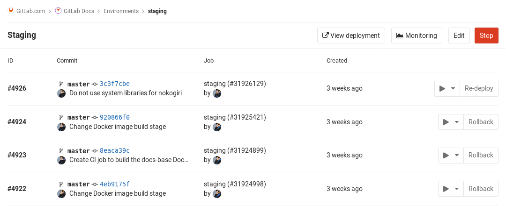

# Introduction to environments and deployments

>**Note:**
Introduced in GitLab 8.9.

During the development of a software there can be many stages until it's ready
for public consumption. You sure want to first see your code in a testing or
staging environment before you release it to the public. That way you can
prevent bugs not only in your software, but in the deployment process as well.

With environments you can control the Continuous Deployment of your software all
within GitLab. All you need to do is define them in your project's
[`.gitlab-ci.yml`][yaml].

In the following sections, we'll see how that works.

## An environments example

Let's assume that you have 

1. Define the environments in `.gitlab-ci.yml`
1. Push the repository to GitLab
1. Runner picks up the job
1. The job finishes successfully
1. The environments get created if they don't already exist
1. A deployment is recorded remembering the environment name and the Git SHA of
   the last commit of the pipeline

Further runs of the CI will

Actions

View environments
View deployments
  Rollback deployments
  Run deployments
View link to environment URL
View last commit message of deployment
View person who performed the deployment
View commit SHA that triggered the deployment
View branch the deployment was based on
View time ago the deployment was performed

Environments are like tags for your CI jobs, describing where code gets deployed.

You can think of names such as testing, staging or production.

CI/CD [Pipelines] usually have one or more [jobs] that deploy to an environment.

Defining environments in a project's `.gitlab-ci.yml` lets developers track
[deployments] to these environments.

The environments page can only be viewed by Reporters and above. For more
information on the permissions, see the [permissions documentation][permissions].

### Defining environments

While you can create and delete environments manually in the web interface, we
recommend that you define your environments in `.gitlab-ci.yml` first. They will
be automatically created for you after the first deploy.

The `environment` keyword is just a hint for GitLab that this job actually
deploys to this environment. Each time the job succeeds, a deployment is
recorded, remembering the Git SHA and environment name.

Add something like this to your `.gitlab-ci.yml`:

```
production:
  stage: deploy
  script: make deploy-to-prod
  environment:
    name: production
```

See the [yaml definition](yaml/README.md#environment) of environments.

### View the environment status

GitLab keeps track of your deployments, so you always know what is currently
being deployed on your servers. You can find the environment list under
**Pipelines > Environments** for your project. You'll see the git SHA and date
of the last deployment to each environment defined.


>**Note:**
Only deploys that happen after your `.gitlab-ci.yml` is properly configured will
show up in the "Environment" and "Last deployment" lists.

## Manually deploying to environments


## Dynamic environments

As the name suggests, it is possible to create environments on the fly by just
declaring their names dynamically in `.gitlab-ci.yml`.

GitLab Runner exposes various [environment variables][variables] when a job runs,
and as such you can use them

```
review:
  stage: deploy
  script:
    - rsync -av --delete public /srv/nginx/pages/$CI_BUILD_REF_NAME
  environment:
    name: review/$CI_BUILD_REF_NAME
    url: https://$CI_BUILD_REF_NAME.example.com
```

### Closing an environment

```
review:
  stage: deploy
  script:
    - rsync -av --delete public /srv/nginx/pages/$CI_BUILD_REF_NAME
  environment:
    name: review/$CI_BUILD_REF_NAME
    url: http://$CI_BUILD_REF_NAME.$APPS_DOMAIN
    on_stop: stop_review

stop_review:
  script: rm -rf /srv/nginx/pages/$CI_BUILD_REF_NAME
  when: manual
  environment:
    name: review/$CI_BUILD_REF_NAME
    action: stop
```

## The relationship between deployments and environments

Deployments are created when [jobs] deploy versions of code to [environments],
so every environment can have one or more deployments. GitLab keeps track of
your deployments, so you always know what is currently being deployed on your
servers.

### View the deployment history

Clicking on an environment will show the history of deployments.



>**Note:**
Only deploys that happen after your `.gitlab-ci.yml` is properly configured will
show up in the environments and deployments lists.

### Checkout deployments locally

Since 8.13, a reference in the git repository is saved for each deployment. So
knowing what the state is of your current environments is only a `git fetch`
away.

In your git config, append the `[remote "<your-remote>"]` block with an extra
fetch line:

```
fetch = +refs/environments/*:refs/remotes/origin/environments/*
```

[Pipelines]: pipelines.md
[jobs]: yaml/README.md#jobs
[yaml]: yaml/README.md
[environments]: #environments
[deployments]: #deployments
[permissions]: ../user/permissions.md
[variables]: variables/README.md
