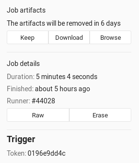

# Triggering Builds through the API

_**Note:** This feature was [introduced][ci-229] in GitLab CE 7.14_

Triggers can be used to force a rebuild of a specific branch, tag or commit,
with an API call.

## Add a trigger

You can add a new trigger by going to your project's **Settings > Triggers**.
The **Add trigger** button will create a new token which you can then use to
trigger a rebuild of this particular project.

Once at least one trigger is created, on the **Triggers** page you will find
some descriptive information on how you can

Every new trigger you create, gets assigned a different token which you can
then use inside your scripts or `.gitlab-ci.yml`. You also have a nice
overview of the time the triggers were last used.


## Revoke a trigger

You can revoke a trigger any time by going at your project's
**Settings > Triggers** and hitting the **Revoke** button. The action is
irreversible.

## Trigger a build

To trigger a build you need to send a `POST` request to GitLab's API endpoint:

```
POST /projects/:id/trigger/builds
```

The required parameters are the trigger's `token` and the Git `ref` on which
the trigger will be performed. Valid refs are the branch, the tag or the commit
SHA. The `:id` of a project can be found by [querying the API](../api/projects.md)
or by visiting the **Triggers** page which provides self-explanatory examples.

When a rebuild is triggered, the information is exposed in GitLab's UI under
the **Builds** page and the builds are marked as `triggered`.


---

You can see which trigger caused the rebuild by visiting the single build page.
The token of the trigger is exposed in the UI as you can see from the image
below.



---

See the [Examples](#examples) section for more details on how to actually
trigger a rebuild.

## Pass build variables to a trigger

You can pass any number of arbitrary variables in the trigger API call and they
will be available in GitLab CI so that they can be used in your `.gitlab-ci.yml`
file. The parameter is of the form:

```
variables[key]=value
```

This information is also exposed in the UI.


---

See the [Examples](#examples) section below for more details.

## Examples

Using cURL you can trigger a rebuild with minimal effort, for example:

```bash
curl -X POST \
     -F token=TOKEN \
     -F ref=master \
     https://gitlab.com/api/v3/projects/9/trigger/builds
```

In this case, the project with ID `9` will get rebuilt on `master` branch.

You can also use triggers in your `.gitlab-ci.yml`. Let's say that you have
two projects, A and B, and you want to trigger a rebuild on the `master`
branch of project B whenever a tag on project A is created.

```yaml
build_docs:
  stage: deploy
  script:
    - "curl -X POST -F token=TOKEN -F ref=master https://gitlab.com/api/v3/projects/9/trigger/builds"
  only:
  - tags
```

[ci-229]: https://gitlab.com/gitlab-org/gitlab-ci/merge_requests/229
