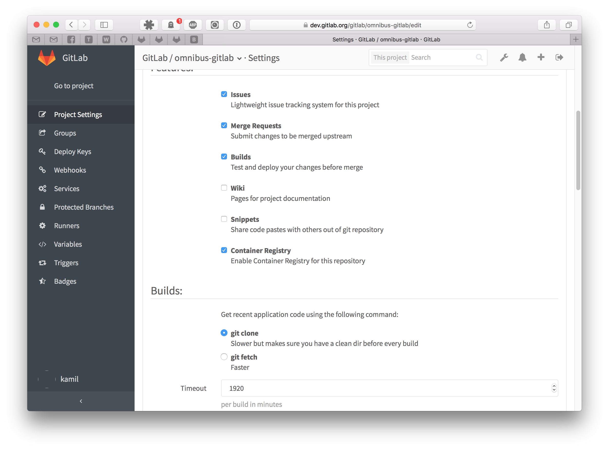
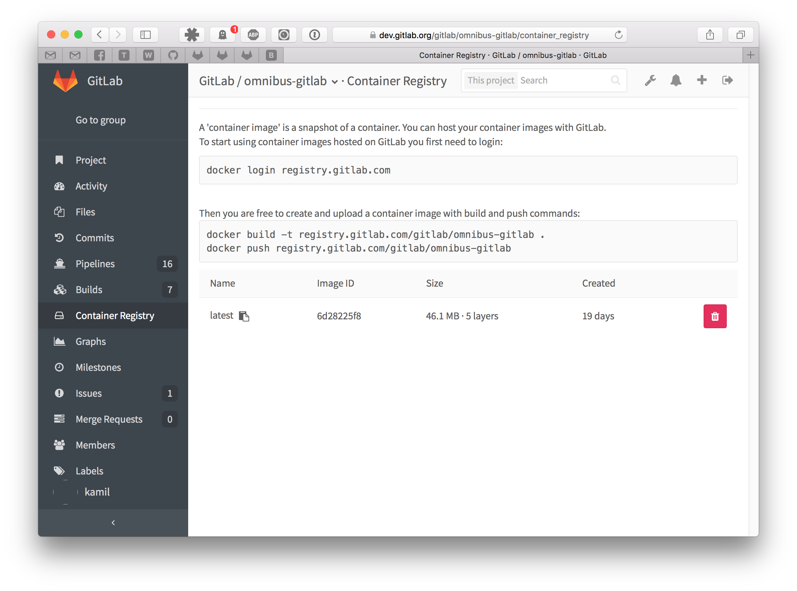

# GitLab Container Registry

> **Note:**
This feature was [introduced][ce-4040] in GitLab 8.8.

With the Docker Container Registry integrated into GitLab, every project can
have its own space to store its Docker images.

You can read more about Docker Registry at https://docs.docker.com/registry/introduction/.

You can read more about administering GitLab Container Registry on [GitLab Container Registry Administration](../administration/container_registry.md)

---

## Start using Container Registry

1. First ask your system administrator to enable GitLab Container Registry following the [administration documentation](../administration/container_registry.md).

2. Go to project settings and enable `Container Registry` feature on your project:



3. Login to Container Registry with your credentials:

```
docker login registry.example.com
```

## Build and push images

Your registry is accessible under address configured via `registry_external_url`.
To start using it you need to first build and publish images:

```
docker build -t registry.example.com/group/project .
docker push registry.example.com/group/project
```

## Use images from GitLab Container Registry

To download and run container from images hosted in GitLab Container Registry use `docker run`:

```
docker run [options] registry.example.com/group/project [arguments]
```

## Control Container Registry from GitLab

GitLab offers simple Container Registry management. Go to your project and click **Container Registry**.
This view will show you all tags in your repository and will easily allow you to delete them.



## Build and push images using GitLab CI

> **Note:**
This feature requires GitLab 8.8 and GitLab Runner 1.2.

Make sure that your GitLab Runner is configured to allow building docker images.
You have to check the [Using Docker Build](../../ci/docker/using_docker_build.md).

You can use [docker:dind](https://hub.docker.com/_/docker/) to build your images. 
This is how the `.gitlab-ci.yml` looks like:

```
 build_image:
   image: docker:git
   services:
   - docker:dind
   stage: build
   script:
     - docker login -u gitlab-ci-token -p $CI_BUILD_TOKEN registry.gitlab.com
     - docker build -t registry.gitlab.com/group/project:latest .
     - docker push registry.gitlab.com/group/project:latest
```

You have to use special credentials `gitlab-ci-token` with password stored in `$CI_BUILD_TOKEN` in order to push to registry connected to your project.
This allows you to automated building and deployment of your images.

## Limitations

In order to use container image from private project as an `image:` in your `.gitlab-ci.yml` you have to follow
[Using a private Docker Registry](https://gitlab.com/gitlab-org/gitlab-ci-multi-runner/blob/master/docs/configuration/advanced-configuration.md#using-a-private-docker-registry).
This workflow will be simplified in the future.
