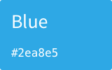
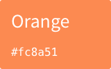
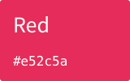
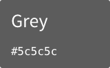

# Basics

## Contents
* [Responsive](#responsive)
* [Typography](#typography)
* [Icons](#icons)
* [Color](#color)
* [Motion](#motion)
* [Voice and tone](#voice-and-tone)

---

 

## Responsive
GitLab is a responsive experience that works well across all screen sizes, from mobile devices to large monitors. In order to provide a great user experience, the core functionality (browsing files, creating issues, writing comments, etc.) must be available at all resolutions. However, due to size limitations, some secondary functionality may be hidden on smaller screens. Please keep this functionality limited to rare actions that aren't expected to be needed on small devices.

---

 

## Typography
### Primary typeface
GitLab's main typeface used throughout the UI is **Source Sans Pro**. We support both the bold and regular weight.

### Monospace typeface
This is the typeface used for code blocks. GitLab uses the OS default font.
- **Menlo** (Mac)
- **Consolas** (Windows)
- **Liberation Mono** (Linux)

---

 

## Icons
GitLab uses Font Awesome icons throughout our interface.

The trash icon is used for destructive actions that deletes information.

The pencil icon is used for editing content such as comments.

The bell icon is for notifications, such as Todos.

The eye icon is for subscribing to updates. For example, you can subscribe to a label and get updated on issues with that label.

The standard RSS icon is used for linking to RSS/atom feeds.

An 'x' is used for closing UI elements such as dropdowns.

A plus is used when creating new objects, such as issues, projects, etc.

>>>
TODO: update this section, add more general guidance to icon usage and personality, etc.
>>>

---

 

## Color

Blue is used to highlight primary active elements (such as current tab), as well as other organization and managing commands.

Green is for actions that create new objects.

Orange is used for warnings

Red is reserved for delete and other destructive commands

Grey, and white (depending on context) is used for netral, secondary elements

>>>
TODO: Establish a perspective for color in terms of our personality and rationalize with Marketing usage.
>>>

---

 

## Motion

Motion is a tool to help convey important relationships, changes or transitions between elements. It should be used sparingly and intentionally, highlighting the right elements at the right moment.

>>>
TODO: Determine a more concrete perspective on motion, create consistent easing/timing curves to follow.
>>>

---

 

## Voice and tone

The copy for GitLab is clear and direct. We strike a clear balance between professional and friendly. We can empathesize with users (such as celebrating completing all Todos), and remain respectful of the importance of the work. We are that trusted, friendly coworker that is helpful and understanding.