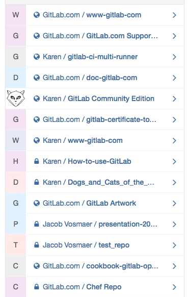

# Command Line basic commands

## Start working on your project

* In Git, when you copy a project you say you "clone" it. To work on a git project locally (from your own computer), you will need to clone it. To do this, start by signing in at GitLab.com.. To do it, go to your [gitlab.com](https://gitlab.com) account

* When you are on your Dashboard, click on the project that you'd like to clone, which you'll find at the right side of your screen



* To work in the project, you can copy a link to the Git repository through a SSH or a HTTPS protocol. SSH is easier to use after it's been [set up](create_your_ssh_keys.md). When you're in the project, click on the HTTPS or SSH button at the right side of your screen. Then copy the link (you'll have to paste it on your shell in the next step)


## On the command line

* To clone your project, go to your computer's shell and type the following command

```
git clone PASTE HTTPS HERE
```

* A clone of the project will be created in your computer
