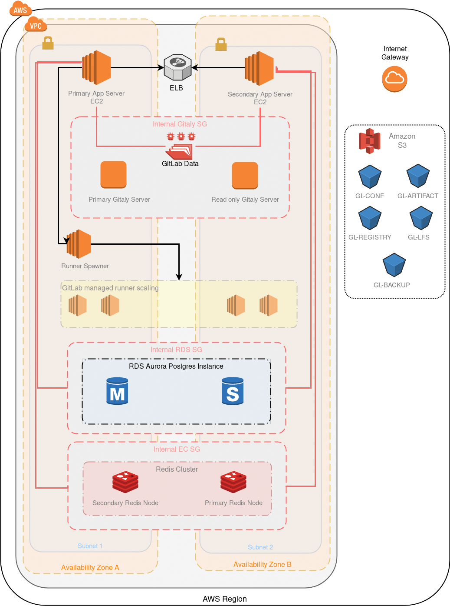
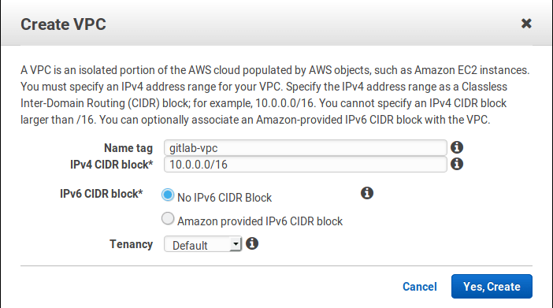
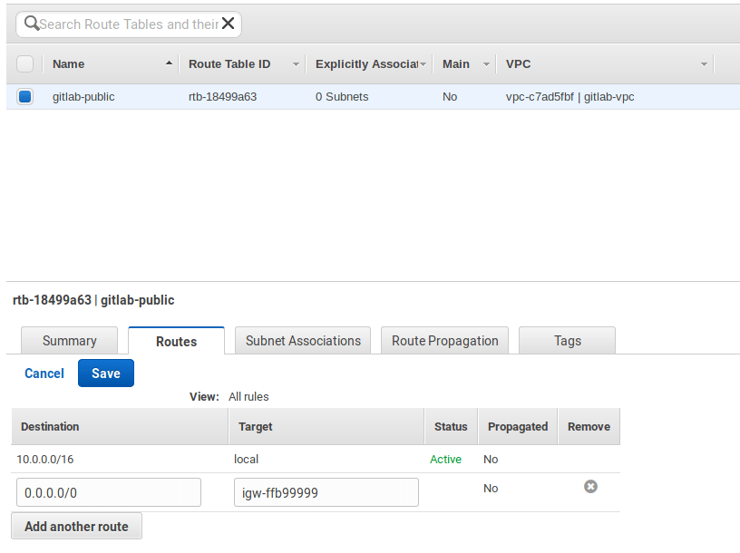
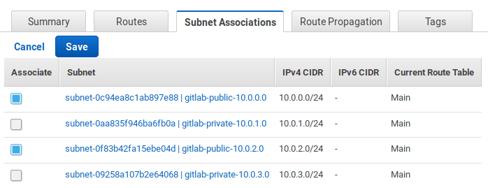

# Installing GitLab on AWS

GitLab can be installed on Amazon Web Services (AWS) by using the official
AMIs provided with each release.

## Introduction

GitLab on AWS can leverage many of the services that are already
configurable with High Availability (HA). These services have a lot of
flexibility and are able to adopt to most companies, best of all is the
ability to automate both vertical and horizontal scaling.

In this guide we'll go through a basic HA setup where we'll start by
configuring our Virtual Private Cloud and subnets to later integrate
services such as RDS for our database server and ElastiCache as a Redis
cluster to finally manage them within an auto scaling group with custom
scaling policies.

## Requirements

A basic familiarity with AWS and EC2 is assumed. In particular, you will need:

- [An AWS account](https://console.aws.amazon.com/console/home)
- [Create or upload](https://docs.aws.amazon.com/AWSEC2/latest/UserGuide/ec2-key-pairs.html)
  an SSH key to connect to the instance via SSH
- A domain name under which GitLab will be reached

## Architecture

Below is the diagram of the architecture.



## Costs

Here's a list of the services we will use and their costs:

- **EC2**: GitLab will deployed on shared hardware which means
  [on-demand pricing](https://aws.amazon.com/ec2/pricing/on-demand)
  will apply. If you want to run it on a dedicated or reserved instance,
  consult the [EC2 pricing page](https://aws.amazon.com/ec2/pricing/) for more
  information on the cost.
- **EBS**: We will also use an EBS volume to store the Git data. See the
  [Amazon EBS pricing](https://aws.amazon.com/ebs/pricing/).
- **S3**: We will use S3 to store backups, artifacts, LFS objects, etc. See the
  [Amazon S3 pricing](https://aws.amazon.com/s3/pricing/).
- **ALB**: An Application Load Balancer will be used to route requests to the
  GitLab instance. See the [Amazon ELB pricing](https://aws.amazon.com/elasticloadbalancing/pricing/).
- **RDS**: An Amazon Relational Database Service using PostgreSQL will be used
  to provide database High Availability. See the
  [Amazon RDS pricing](https://aws.amazon.com/rds/postgresql/pricing/).

## Creating an IAM EC2 instance role and profile

To minimize the permissions of the user, we'll create a new IAM role with
limited access:

1. Navigate to the IAM dashboard https://console.aws.amazon.com/iam/home and
   click on **Create role**.
1. Create a new role by choosing to **AWS service > EC2**. Once done, click on
   **Next: Permissions**.

    

1. Choose **AmazonEC2FullAccess** and **AmazonS3FullAccess** and click on **Next: Review**.
1. Give the role the name `GitLabAdmin` and click **Create role**.

    

## Configuring the network

We'll start by creating a VPC for our GitLab cloud infrastructure, then
we can create subnets to have public and private instances in at least
two AZs. Public subnets will require a Route Table keep and an associated
Internet Gateway.

### VPC

Let's create a VPC:

1. Navigate to https://console.aws.amazon.com/vpc/home
1. Select **Your VPCs** from the left menu and then click on **Create VPC**.
   At the name tag enter `gitlab-vpc` and at the IPv4 CIDR block enter `10.0.0.0/16`.
   If you don't require dedicated hardware, you can leave tenancy as default.
   Click **Yes, Create** when ready.

    

### Subnet

Now, let's create some subnets in different Availability Zones. Make sure
that each subnet is associated the the VPC we just created and
that CIDR blocks don't overlap. This will also
allow us to enable multi AZ for redundancy.

We will create private and public subnets to match load balancers and
RDS instances as well:

1. Select **Subnets** from the left menu.
1. Click on **Create subnet**. Give it a descriptive name tag based on the IP,
   for example `gitlab-public-10.0.0.0`, select the VPC we created previously,
   and at the IPv4 CIDR block let's give it a 24 subnet `10.0.0.0/24`:

    

1. Follow the same steps to create all subnets:

    | Name tag | Availability Zone | CIDR block |
    | -------- | ----------------- | ---------- |
    | gitlab-public-10.0.0.0  | us-west-2a | 10.0.0.0 |
    | gitlab-private-10.0.1.0 | us-west-2a | 10.0.1.0 |
    | gitlab-public-10.0.2.0  | us-west-2b | 10.0.2.0 |
    | gitlab-private-10.0.3.0 | us-west-2b | 10.0.3.0 |

### Route Table

Up to now all our subnets are private. We need to create a Route Table
to associate an Internet Gateway. On the same VPC dashboard:

1. Select **Route Tables** from the left menu.
1. Click **Create Route Table**.
1. At the "Name tag" enter `gitlab-public` and choose `gitlab-vpc` under "VPC".
1. Hit **Yes, Create**.

### Internet Gateway

Now, still on the same dashboard head over to Internet Gateways and
create a new one:

1. Select **Internet Gateways** from the left menu.
1. Click on **Create internet gateway**, give it the name `gitlab-gateway` and
   click **Create**.
1. Select it from the table, and then under the **Actions** dropdown choose
   "Attach to VPC".

    

1. Choose `gitlab-vpc` from the list and hit **Attach**.

### Configuring subnets

We now need to add a new target which will be our Internet Gateway and have
it receive traffic from any destination.

1. Select **Route Tables** from the left menu and select the `gitlab-public`
   route to show the options at the bottom.
1. Select the **Routes** tab, hit **Edit > Add another route** and set `0.0.0.0/0`
   as destination. In the target, select the `gitlab-gateway` we created previously.
   Hit **Save** once done.

    

Next, we must associate the **public** subnets to the route table:

1. Select the **Subnet Associations** tab and hit **Edit**.
1. Check only the public subnet and hit **Save**.

    

---

Now that we're done with the network, let's create a security group.

## Creating a security group

The security group is basically the firewall.

1. Select **Security Groups** from the left menu.
1. Click on **Create Security Group** and fill in the details. Give it a name,
   add a description, and choose the VPC we created previously
1. Select the security group from the list and at the the bottom select the
   Inbound Rules tab. You will need to open the SSH, HTTP, and HTTPS ports. Set
   the source to `0.0.0.0/0`.

     

     TIP: **Tip:**
     Based on best practices, you should only allow SSH traffic from only a known
     host or CIDR block. In that case, change the SSH source to be custom and give
     it the IP you want to SSH from.

1. When done, click on **Save**.

## PostgreSQL with RDS

For our database server we will use Amazon RDS which offers Multi AZ
for redundancy. Lets start by creating a subnet group and then we'll
create the actual RDS instance.

### RDS Subnet Group

From the RDS dashboard select Subnet Groups. Lets select our VPC from
the VPC ID dropdown and at the bottom we can add our private subnets.


### Creating the database

Select the RDS service from the Database section and create a new
PostgreSQL instance. After choosing between a Production or
Development instance we'll start with the actual configuration. On the
image bellow we have the settings for this article but note the
following two options which are of particular interest for HA:

1. Multi-AZ-Deployment is recommended as redundancy. Read more at
[High Availability (Multi-AZ)](http://docs.aws.amazon.com/AmazonRDS/latest/UserGuide/Concepts.MultiAZ.html)
1. While we chose a General Purpose (SSD) for this article a Provisioned
IOPS (SSD) is best suited for HA. Read more about it at
[Storage for Amazon RDS](http://docs.aws.amazon.com/AmazonRDS/latest/UserGuide/CHAP_Storage.html)


The rest of the setting on this page request a DB identifier, username
and a master password. We've chosen to use `gitlab-ha`, `gitlab` and a
very secure password respectively. Keep these in hand for later.


Make sure to choose our gitlab VPC, our subnet group, not have it public,
and to leave it to create a new security group. The only additional
change which will be helpful is the database name for which we can use
`gitlabhq_production`.

***

## Redis with ElastiCache

EC is an in-memory hosted caching solution. Redis maintains its own
persistence and is used for certain types of application.

Let's choose the ElastiCache service in the Database section from our
AWS console. Now lets create a cache subnet group which will be very
similar to the RDS subnet group. Make sure to select our VPC and its
private subnets.


Now press the Launch a Cache Cluster and choose Redis for our
DB engine. You'll be able to configure details such as replication,
Multi AZ and node types. The second section will allow us to choose our
subnet and security group and     


## Deploying GitLab

We'll use AWS's wizard to deploy GitLab and then SSH into the instance to
configure the domain name.

### Choose the AMI

1. On the EC2 dashboard click **Launch Instance**.
1. Choose the AMI by going to the Community AMIs and search for `GitLab EE <version>`
   where `<version>` the latest version as seen  in the
   [releases page](https://about.gitlab.com/releases/).

    

### Choose instance type

Based on [GitLab's requirements](../requirements.md#hardware-requirements), the
instance type should be at least `c4.xlarge`. This is enough to accommodate 100 users:

1. Choose the `c4.xlarge` instance.

    

1. Click **Next: Configure Instance Details**

### Configure instance

1. Configure the instance. At "Network" choose `gitlab-vpc` and the subnet we
   created for that VPC. Select "Enable" for the "Auto-assign Public IP" and
   choose the `GitLabAdmin` IAM role.

    

1. Click **Next: Add Storage**.

### Add storage

Edit the root volume to 20GB, and add a new EBS volume that will host the Git data.
Its size depends on your needs and you can always migrate to a bigger volume later.


### Add tags

To help you manage your instances, you can optionally assign your own metadata
to each resource in the [form of tags](https://docs.aws.amazon.com/console/ec2/tags).

Let's add one with its key set to `Name` and value to `GitLab`.


### Configure security group

1. Select the existing security group we [have created](#creating-a-security-group).

    

1. Select **Review and Launch**.

### Review and launch

Now is a good time to review all the previous settings. Click **Launch** and
select the SSH key pair you have created previously.


Finally, click on **Launch instances**.

### RDS and Redis Security Group

After the instance is being created we will navigate to our EC2 security
groups and add a small change for our EC2 instances to be able to
connect to RDS. First copy the security group name we just defined,
namely `gitlab-ec2-security-group`, and edit select the RDS security
group and edit the inbound rules. Choose the rule type to be PostgreSQL
and paste the name under source.


Similar to the above we'll jump to the `gitlab-ec2-security-group` group
and add a custom TCP rule for port 6379 accessible within itself.

## Load Balancer

On the same dashboard look for Load Balancer on the left column and press
the Create button. Choose a classic Load Balancer, our gitlab VPC, not
internal and make sure its listening for HTTP and HTTPS on port 80.

Here is a tricky part though, when adding subnets we need to associate
public subnets instead of the private ones where our instances will
actually live.

On the security group section let's create a new one named
`gitlab-loadbalancer-sec-group` and allow both HTTP ad HTTPS traffic
from anywhere.

The Load Balancer Health will allow us to indicate where to ping and what
makes up a healthy or unhealthy instance.

We won't add the instance on the next session because we'll destroy it
momentarily as we'll be using the image we where creating. We will keep
the Enable Cross-Zone and Enable Connection Draining active.

After we finish creating the Load Balancer we can re visit our Security
Groups to improve access only through the ELB and any other requirement
you might have.

## Auto Scaling Group

Our AMI should be done by now so we can start working on our Auto
Scaling Group.

This option is also available through the EC2 dashboard on the left
sidebar. Press on the create button. Select the new image on My AMIs and
give it a `t2.medium` size. To be able to use Elastic File System we need
to add a script to mount EFS automatically at launch. We'll do this at
the Advanced Details section where we have a [User Data](http://docs.aws.amazon.com/AWSEC2/latest/UserGuide/user-data.html)
text area that allows us to add a lot of custom configurations which
allows you to add a custom script for when launching an instance. Let's
add the following script to the User Data section:


    #cloud-config
    package_upgrade: true
    packages:
    - nfs-common
    runcmd:
    - mkdir -p /gitlab-data
    - chown ec2-user:ec2-user /gitlab-data
    - echo "$(curl --silent http://169.254.169.254/latest/meta-data/placement/availability-zone).file-system-id.aws-region.amazonaws.com:/ /gitlab-data nfs defaults,vers=4.1 0 0" >> /etc/fstab
    - mount -a -t nfs
    - sudo gitlab-ctl reconfigure

On the security group section we can choose our existing
`gitlab-ec2-security-group` group which has already been tested.

After this is launched we are able to start creating our Auto Scaling
Group. Start by giving it a name and assigning it our VPC and private
subnets. We also want to always start with two instances and if you
scroll down to Advanced Details we can choose to receive traffic from ELBs.
Lets enable that option and select our ELB. We also want to use the ELB's
health check.


### Policies

This is the really great part of Auto Scaling, we get to choose when AWS
launches new instances and when it removes them. For this group we'll
scale between 2 and 4 instances where one instance will be added if CPU
utilization is greater than 60% and one instance is removed if it falls
to less than 45%. Here are the complete policies:


You'll notice that after we save this AWS starts launching our two
instances in different AZs and without a public IP which is exactly what
we where aiming for.

## After deployment

After a few minutes, the instance should be up and accessible via the internet.
Let's connect to it and configure some things before logging in.

### Configuring GitLab to connect with postgres and Redis

While connected to your server edit the `gitlab.rb` file at `/etc/gitlab/gitlab.rb`
find the `external_url 'http://gitlab.example.com'` option and change it
to the domain you will be using or the public IP address of the current
instance to test the configuration.

For a more detailed description about configuring GitLab read [Configuring GitLab for HA](http://docs.gitlab.com/ee/administration/high_availability/gitlab.html)

Now look for the GitLab database settings and uncomment as necessary. In
our current case we'll specify the adapter, encoding, host, db name,
username, and password.

    gitlab_rails['db_adapter'] = "postgresql"
    gitlab_rails['db_encoding'] = "unicode"    
    gitlab_rails['db_database'] = "gitlabhq_production"   
    gitlab_rails['db_username'] = "gitlab"
    gitlab_rails['db_password'] = "mypassword"
    gitlab_rails['db_host'] = "<rds-endpoint>"

Next we only need to configure the Redis section by adding the host and
uncommenting the port.

The last configuration step is to [change the default file locations ](http://docs.gitlab.com/ee/administration/high_availability/nfs.html)
to make the EFS integration easier to manage.

    gitlab_rails['redis_host'] = "<redis-endpoint>"
    gitlab_rails['redis_port'] = 6379

Finally run reconfigure, you might find it useful to run a check and
a service status to make sure everything has been setup correctly.

    sudo gitlab-ctl reconfigure  
    sudo gitlab-rake gitlab:check  
    sudo gitlab-ctl status  

If everything looks good copy the Elastic IP over to your browser and
test the instance manually.

### Setting up the EBS volume

The EBS volume will host the Git data. We need to first format the `/dev/xvdb`
volume and then mount it:

1. First, create the directory that the volume will be mounted to:

    ```sh
    sudo mkdir /gitlab-data
    ```

1. Create a partition with a GUID Partition Table (GPT), mark it as
   primary, choose the `ext4` file system, and use all its size:

    ```sh
    sudo parted --script /dev/xvdb mklabel gpt mkpart primary ext4 0% 100%
    ```

1. Format to `ext4`:

    ```sh
    sudo mkfs.ext4 -L Data /dev/xvdb1
    ```

1. Find its PARTUUID:

    ```sh
    blkid /dev/xvdb1
    ```

    You need to copy the PARTUUID number (without the quotes) and use this to
    mount the newly created partition.

1. Open `/etc/fstab` with your editor, comment out the entry about `/dev/xvdb`,
   and add the new partition:

    ```
    PARTUUID=d4129b25-a3c9-4d2c-a090-2c234fee4d46   /gitlab-data   ext4    defaults,nofail,x-systemd.requires=cloud-init.service,comment=cloudconfig       0       2
    ```

1. Mount the partition:

    ```sh
    sudo mount -a
    ```

---

Now that the partition is created and mounted, it's time to tell GitLab to store
its data to the new `/gitlab-data` directory:

1. Edit `/etc/gitlab/gitlab.rb` with your editor and add the following:

    ```ruby
    git_data_dirs({ "default" => { "path" => "/gitlab-data" } })
    ```

1. Save the file and reconfigure GitLab:

    ```sh
    sudo gitlab-ctl reconfigure
    ```

Read more on [storing Git data in an alternative directory](https://docs.gitlab.com/omnibus/settings/configuration.html#storing-git-data-in-an-alternative-directory).

### Using S3 for the LFS objects, artifacts and Registry images

The S3 object storage can be used for various GitLab objects:

- [How to store the LFS objects in S3](../../workflow/lfs/lfs_administration.md#s3-for-omnibus-installations) ((Omnibus GitLab installations))
- [How to store Container Registry images to S3](../../administration/container_registry.md#container-registry-storage-driver) (Omnibus GitLab installations)
- [How to store GitLab CI job artifacts to S3](../../administration/job_artifacts.md#using-object-storage) (Omnibus GitLab installations)

### Setting up a domain name

After you SSH into the instance, configure the domain name:

1. Open `/etc/gitlab/gitlab.rb` with your favorite editor.
1. Edit the `external_url` value:

    ```ruby
    external_url 'http://example.com'
    ```

1. Reconfigure GitLab:

    ```sh
    sudo gitlab-ctl reconfigure
    ```

You should now be able to reach GitLab at the URL you defined. To use HTTPS
(recommended), see the [HTTPS documentation](https://docs.gitlab.com/omnibus/settings/nginx.html#enable-https).

### Logging in for the first time

If you followed the previous section, you should be now able to visit GitLab
in your browser. The very first time, you will be asked to set up a password
for the `root` user which has admin privileges on the GitLab instance.

After you set it up, login with username `root` and the newly created password.

## Backup and restore

GitLab provides [a tool to backup](../../raketasks/backup_restore.md#creating-a-backup-of-the-gitlab-system)
and restore its Git data, database, attachments, LFS objects, etc.

Some things to know:

- By default, the backup files are stored locally, but you can
  [backup GitLab using S3](../../raketasks/backup_restore.md#using-amazon-s3).
- You can exclude [specific directories form the backup](../../raketasks/backup_restore.md#excluding-specific-directories-from-the-backup).
- The backup/restore tool does not store some configuration files, like secrets, you'll
  need to [do it yourself](../../raketasks/backup_restore.md#storing-configuration-files).

### Backing up GitLab

To backup GitLab:

1. SSH into your instance.
1. Take a backup:

    ```sh
    sudo gitlab-rake gitlab:backup:create
    ```

### Restoring GitLab from a backup

To restore GitLab, first check the [restore documentation](../../raketasks/backup_restore.md#restore)
and mainly the restore prerequisites. Then, follow the steps under the
[Omnibus installations section](../../raketasks/backup_restore.md#restore-for-omnibus-installations).

## Updating GitLab

GitLab releases a new version every month on the 22nd. Whenever a new version is
released, you can update your GitLab instance:

1. SSH into your instance
1. Take a backup:

    ```sh
    sudo gitlab-rake gitlab:backup:create
    ```

1. Update the repositories and install GitLab:

    ```sh
    sudo apt update
    sudo apt install gitlab-ee
    ```

After a few minutes, the new version should be up and running.

## Resources

- [Omnibus GitLab](https://docs.gitlab.com/omnibus/) - Everything you need to know
  about administering your GitLab instance.
- [Upload a license](https://docs.gitlab.com/ee/user/admin_area/license.html) - Activate all GitLab
  Enterprise Edition functionality with a license.
