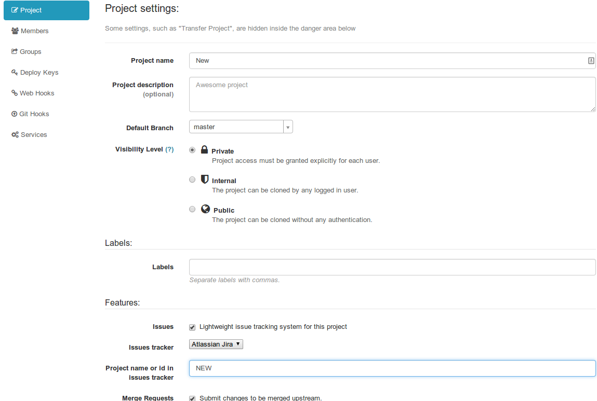

# GitLab JIRA integration

GitLab can be configured to interact with JIRA

*Note* Directions below are for JIRA v6.x and GitLab v6.x

## Configuring JIRA

We need to create a user in JIRA which will have access to all projects that need to integrate with GitLab.
Login to your JIRA instance as admin and under Administration -> User Management create a new user.
For example, let's create user `gitlab`. We've also added `gitlab` user to group `jira-developers` which grants it access to projects.

## Configuring GitLab

In `gitlab.yml` enable [JIRA issue tracker section by uncommenting the lines](https://gitlab.com/subscribers/gitlab-ee/blob/6-8-stable-ee/config/gitlab.yml.example#L111-115).
This will make sure that all issues within GitLab are pointing to the JIRA issue tracker.

We can also enable JIRA service that will allow us to interact with JIRA issues. 

For example, we can close issues in JIRA by a commit in GitLab.

Go to project settings page and fill in the project name for the JIRA project:

Next, go to the services page and find JIRA.

1. Tick the active check box to enable the service.
1. Supply the url to JIRA server, for example http://jira.sample
1. Supply the username of a user we created under `Configuring JIRA` section, for example `gitlab`
1. Supply the password of the user
1. Optional: supply the JIRA api version, default is version 2
1. Save

Now we should be able to interact with JIRA issues, for example we can close a JIRA issue by commiting to our GitLab repository and referencing the JIRA issue( in the format of JIRAPROJECT-123). 

For example, for project named NEW we commit with a commit message `Add new file fixes NEW-1`:

That will close an issue NEW-1 in JIRA and add a comment with a link to the commit that closed the issue:

