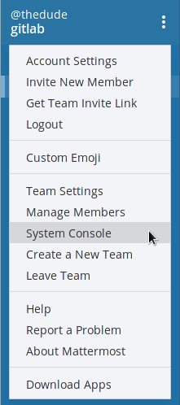
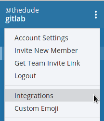
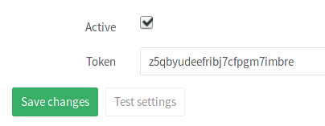

# Mattermost slash commands

> Introduced in GitLab 8.14

Mattermost commands give users an extra interface to perform common operations
from the chat environment. This allows one to, for example, create an issue as
soon as the idea was discussed in Mattermost.

## Prerequisites

Mattermost 3.4 and up is required.

If you have the Omnibus GitLab package installed, Mattermost is already bundled
in it. All you have to do is configure it. Read more in the
[Omnibus GitLab Mattermost documentation][omnimmdocs].

## Configuration

The configuration consists of two parts. First you need to enable the slash
commands in Mattermost and then enable the service in GitLab.

### Step 1. Enable custom slash commands in Mattermost

This step is only required when using a source install, omnibus installs will be
preconfigured with the right settings. 

The first thing to do in Mattermost is to enable custom slash commands from
the administrator console.

1. Log in with an account that has admin privileges and navigate to the system
   console.

    

    ---

1. Click **Custom integrations** and set **Enable Custom Slash Commands**, 
   **Enable custom integrations to override usernames**, and **Override 
   custom integrations to override profile picture icons** to true

    

    ---

1. Click **Save** at the bottom to save the changes.

### Step 2. Open the Mattermost slash commands service in GitLab

1. Open a new tab for GitLab and go to your project's settings
   **Services ➔ Mattermost command**. A screen will appear with all the values you
   need to copy in Mattermost as described in the next step. Leave the window open.

    >**Note:**
    GitLab will propose some values for the Mattermost settings. The only one
    required to copy-paste as-is is the **Request URL**, all the others are just
    suggestions.

    

    ---

1. Proceed to the next step and create a slash command in Mattermost with the
   above values.

### Step 3. Create a new custom slash command in Mattermost

Now that you have enabled custom slash commands in Mattermost and opened
the Mattermost slash commands service in GitLab, it's time to copy these values
in a new slash command.

1. Back to Mattermost, under your team page settings, you should see the
   **Integrations** option.

    

    ---

1. Go to the **Slash Commands** integration and add a new one by clicking the
   **Add Slash Command** button.

    

    ---

1. Fill in the options for the custom command as described in
   [step 2](#step-2-open-the-mattermost-slash-commands-service-in-gitlab).

    >**Note:**
    If you plan on connecting multiple projects, pick a slash command trigger
    word that relates to your projects such as `/gitlab-project-name` or even
    just `/project-name`. Only use `/gitlab` if you will only connect a single
    project to your Mattermost team.

    

1. After you setup all the values, copy the token (we will use it below) and
   click **Done**.

    

### Step 4. Copy the Mattermost token into the Mattermost slash command service

1. In GitLab, paste the Mattermost token you copied in the previous step and
   check the **Active** checkbox.

    

1. Click **Save changes** for the changes to take effect.

---

You are now set to start using slash commands in Mattermost that talk to the
GitLab project you configured.

## Authorizing Mattermost to interact with GitLab

The first time a user will interact with the newly created slash commands,
Mattermost will trigger an authorization process.

This will connect your Mattermost user with your GitLab user. You can
see all authorized chat accounts in your profile's page under **Chat**.

When the authorization process is complete, you can start interacting with
GitLab using the Mattermost commands.

## Available slash commands

The available slash commands are:

| Command | Description | Example |
| ------- | ----------- | ------- |
| <kbd>/&lt;trigger&gt; issue create &lt;title&gt; **Shift** + **Enter** &lt;description&gt;</kbd> | Create a new issue in the project that `<trigger>` is tied to. `<description>` is optional. | <samp>/gitlab issue create We need to change the homepage</samp> |
| <kbd>/&lt;trigger&gt; issue show &lt;issue-number&gt;</kbd> | Show the issue with ID `<issue-number>` from the project that `<trigger>` is tied to. | <samp>/gitlab issue show 42</samp> |
| <kbd>/&lt;trigger&gt; deploy &lt;environment&gt; to &lt;environment&gt;</kbd> | Start the CI job that deploys from one environment to another, for example `staging` to `production`. CI/CD must be [properly configured][ciyaml]. | <samp>/gitlab deploy staging to production</samp> |

To see a list of available commands to interact with GitLab, type the
trigger word followed by <kbd>help</kbd>. Example: <samp>/gitlab help</samp>

## Permissions

The permissions to run the [available commands](#available-commands) derive from
the [permissions you have on the project](../user/permissions.md#project).

## Further reading

- [Mattermost slash commands documentation][mmslashdocs]
- [Omnibus GitLab Mattermost][omnimmdocs]

[omnimmdocs]: https://docs.gitlab.com/omnibus/gitlab-mattermost/
[mmslashdocs]: https://docs.mattermost.com/developer/slash-commands.html
[ciyaml]: ../ci/yaml/README.md
