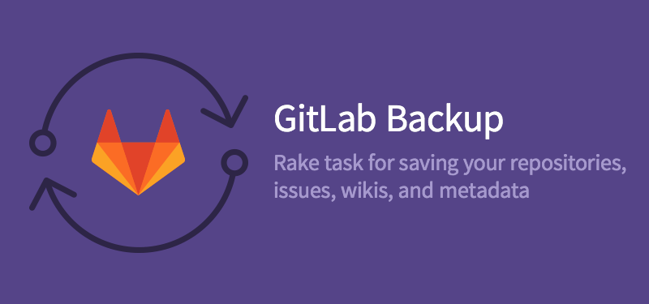

# Backup restore



## Create a backup of the GitLab system

A backup creates an archive file that contains the database, all repositories and all attachments.
This archive will be saved in backup_path (see `config/gitlab.yml`).
The filename will be `[TIMESTAMP]_gitlab_backup.tar`. This timestamp can be used to restore an specific backup.
You can only restore a backup to exactly the same version of GitLab that you created it on, for example 7.2.1.

```
# use this command if you've installed GitLab with the Omnibus package
sudo gitlab-rake gitlab:backup:create

# if you've installed GitLab from source or using the cookbook
bundle exec rake gitlab:backup:create RAILS_ENV=production
```

Example output:

```
Dumping database tables:
- Dumping table events... [DONE]
- Dumping table issues... [DONE]
- Dumping table keys... [DONE]
- Dumping table merge_requests... [DONE]
- Dumping table milestones... [DONE]
- Dumping table namespaces... [DONE]
- Dumping table notes... [DONE]
- Dumping table projects... [DONE]
- Dumping table protected_branches... [DONE]
- Dumping table schema_migrations... [DONE]
- Dumping table services... [DONE]
- Dumping table snippets... [DONE]
- Dumping table taggings... [DONE]
- Dumping table tags... [DONE]
- Dumping table users... [DONE]
- Dumping table users_projects... [DONE]
- Dumping table web_hooks... [DONE]
- Dumping table wikis... [DONE]
Dumping repositories:
- Dumping repository abcd... [DONE]
Creating backup archive: $TIMESTAMP_gitlab_backup.tar [DONE]
Deleting tmp directories...[DONE]
Deleting old backups... [SKIPPING]
```

## Storing configuration files

Please be informed that a backup does not store your configuration files.
If you use an Omnibus package please see the [instructions in the readme to backup your configuration](https://gitlab.com/gitlab-org/omnibus-gitlab/blob/master/README.md#backup-and-restore-omnibus-gitlab-configuration).
If you have a cookbook installation there should be a copy of your configuration in Chef.
If you have a manual installation please consider backing up your gitlab.yml file and any SSL keys and certificates.

## Restore a previously created backup

You can only restore a backup to exactly the same version of GitLab that you created it on, for example 7.2.1.

```
# Omnibus package installation
sudo gitlab-rake gitlab:backup:restore

# installation from source or cookbook
bundle exec rake gitlab:backup:restore RAILS_ENV=production
```

Options:

```
BACKUP=timestamp_of_backup (required if more than one backup exists)
```

Example output:

```
Unpacking backup... [DONE]
Restoring database tables:
-- create_table("events", {:force=>true})
   -> 0.2231s
[...]
- Loading fixture events...[DONE]
- Loading fixture issues...[DONE]
- Loading fixture keys...[SKIPPING]
- Loading fixture merge_requests...[DONE]
- Loading fixture milestones...[DONE]
- Loading fixture namespaces...[DONE]
- Loading fixture notes...[DONE]
- Loading fixture projects...[DONE]
- Loading fixture protected_branches...[SKIPPING]
- Loading fixture schema_migrations...[DONE]
- Loading fixture services...[SKIPPING]
- Loading fixture snippets...[SKIPPING]
- Loading fixture taggings...[SKIPPING]
- Loading fixture tags...[SKIPPING]
- Loading fixture users...[DONE]
- Loading fixture users_projects...[DONE]
- Loading fixture web_hooks...[SKIPPING]
- Loading fixture wikis...[SKIPPING]
Restoring repositories:
- Restoring repository abcd... [DONE]
Deleting tmp directories...[DONE]
```

## Configure cron to make daily backups

For Omnibus package installations, see https://gitlab.com/gitlab-org/omnibus-gitlab/blob/master/README.md#scheduling-a-backup .

For installation from source or cookbook:
```
cd /home/git/gitlab
sudo -u git -H editor config/gitlab.yml # Enable keep_time in the backup section to automatically delete old backups
sudo -u git crontab -e # Edit the crontab for the git user
```

Add the following lines at the bottom:

```
# Create a full backup of the GitLab repositories and SQL database every day at 4am
0 4 * * * cd /home/git/gitlab && PATH=/usr/local/bin:/usr/bin:/bin bundle exec rake gitlab:backup:create RAILS_ENV=production
```
