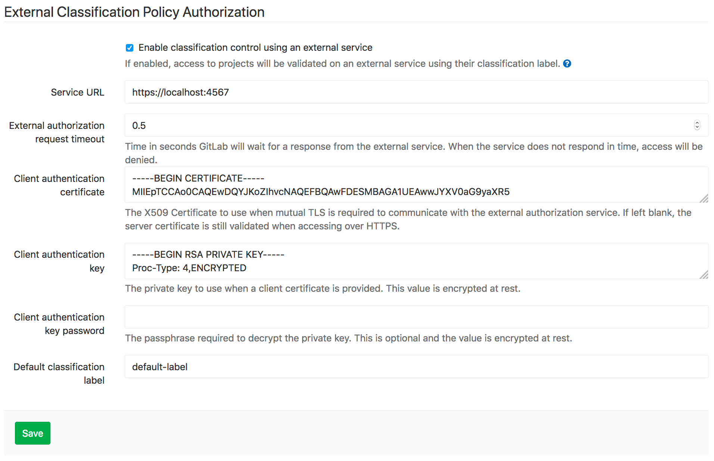

# External authorization control

>
[Introduced](https://gitlab.com/gitlab-org/gitlab-ee/issues/4216) in
[GitLab Premium](https://about.gitlab.com/pricing) 10.6.

In highly controlled environments, it may be necessary for access policy to be
controlled by an external service that permits access based on project
classification and user access. GitLab provides a way to check project
authorization with your own defined service.

## Overview

Once the external service is configured and enabled, when a project is accessed,
a request is made to the external service with the user information and project
classification label assigned to the project. When the service replies with a
known response, the result is cached for 6 hours.

If the external authorization is enabled, GitLab will further block pages and
functionality that render cross-project data. That includes:

- most pages under Dashboard (Activity, Milestones, Snippets, Assigned merge
  requests, Assigned issues, Todos)
- under a specific group (Activity, Contribution analytics, Issues, Issue boards,
  Labels, Milestones, Merge requests)
- Global and Group search will be disabled

This is to prevent performing to many requests at once to the external
authorization service.

## Configuration

The external authorization service can be enabled by an admin on the GitLab's
admin area under the settings page:



The available required properties are:

- **Service URL**: The URL to make authorization requests to. When leaving the
  URL blank, cross project features will remain available while still being able
  to specify classification labels for projects.
- **External authorization request timeout**: The timeout after which an
  authorization request is aborted. When a request times out, access is denied
  to the user.
- **Client authentication certificate**: The certificate to use to authenticate
  with the external authorization service.
- **Client authentication key**: Private key for the certificate when
  authentication is required for the external authorization service, this is
  encrypted when stored.
- **Client authentication key password**: Passphrase to use for the private key when authenticating with the external service this is encrypted when stored.
- **Default classification label**: The classification label to use when
  requesting authorization if no specific label is defined on the project

When using TLS Authentication with a self signed certificate, the CA certificate
needs to be trused by the openssl installation. When using GitLab installed using
Omnibus, learn to install a custom CA in the
[omnibus documentation][omnibus-ssl-docs]. Alternatively learn where to install
custom certificates using `openssl version -d`.

## How it works

When GitLab requests access, it will send a JSON POST request to the external
service with this body:

```json
{
  "user_identifier": "jane@acme.org",
  "project_classification_label": "project-label",
  "user_ldap_dn": "CN=Jane Doe,CN=admin,DC=acme"
}
```

The `user_ldap_dn` is optional and is only sent when the user is logged in
through LDAP.

When the external authorization service responds with a status code 200, the
user is granted access. When the external service responds with a status code
401, the user is denied access. In any case, the request is cached for 6 hours.

When denying access, a `reason` can be optionally specified in the JSON body:

```json
{
  "reason": "You are not allowed access to this project."
}
```

Any other status code than 401 or 200 will also deny access to the user, but the
response will not be cached.

If the service times out (after 500ms), a message "External Policy Server did
not respond" will be displayed.

## Classification labels

You can use your own classification label in the project's
**Settings > General > General project settings** page in the "Classification
label" box. When no classification label is specified on a project, the default
label defined in the [global settings](#configuration) will be used.

The label will be shown on all project pages in the upper right corner.


[omnibus-ssl-docs]: https://docs.gitlab.com/omnibus/settings/ssl.html
