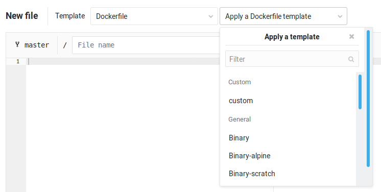

# Instance-level Template Repository

> [Introduced](https://gitlab.com/gitlab-org/gitlab-ee/issues/5986) in
> [GitLab Premium](https://about.gitlab.com/pricing) 11.3.

## Overview

In hosted systems, enterprises often have a need to share their own templates
across teams. This feature allows an administrator to pick a project to be the
instance-wide collection of templates. These templates are then exposed to all
users while the project remains secure. Currently supported templates: Licenses.

## Configuration

An administrator can choose any project to be the template repository. This is
done through the `Settings` page in the `Admin Area` or through the API. On the
`Settings` page, there is a `Templates` section with a selection box for
choosing a project:


Once a project has been selected you can add custom templates to the repository,
and they will appear in the appropriate places in the frontend and API.
Templates must be added to a specific subdirectory in the repository,
corresponding to the kind of template. They must also have the correct extension
for the template type.

Currently, only custom license templates are supported. This must go in the
`LICENSE/` subdirectory, and must have `.txt` file extensions. So, the hierarchy
should look like this:

```text
|-- README.md
|-- LICENSE
    |-- custom_license.txt
    |-- another_license.txt
```

Once this is established, the list of `Custom` licenses will be included when
creating a new file and the file type is `License`. These will appear at the
bottom of the list:



If this feature has been disabled or no licenses are present, then there will be
no `Custom` section in the selection dropdown.
