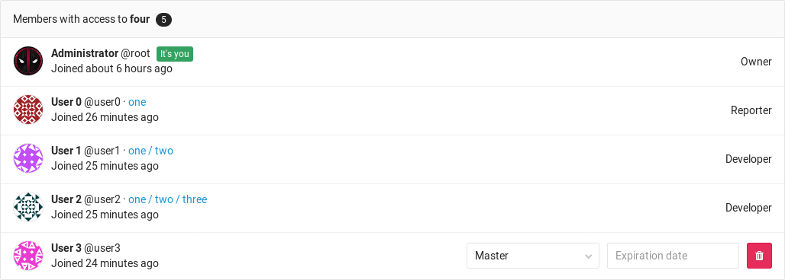
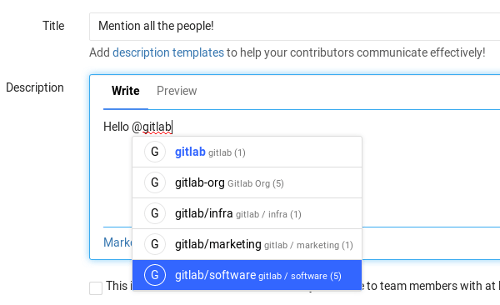

# Subgroups

>**Notes:**
- [Introduced][ce-2772] in GitLab 9.0.
- MySQL support for subgroups was dropped in GitLab 9.3.

With subgroups (aka nested groups or hierarchical groups) you can have
up to 20 levels of nested groups, which among other things can help you to:

- **Separate internal / external organizations.** Since every group
  can have its own visibility level, you are able to host groups for different
  purposes under the same umbrella.
- **Organize large projects.** For large projects, subgroups makes it
  potentially easier to separate permissions on parts of the source code.
- **Make it easier to manage people and control visibility.** Give people
  different [permissions][] depending on their group [membership](#membership).

## Database Requirements

Nested groups are only supported when you use PostgreSQL. Supporting nested
groups on MySQL in an efficient way is not possible due to MySQL's limitations.
See the following links for more information:

* <https://gitlab.com/gitlab-org/gitlab-ce/issues/30472>
* <https://gitlab.com/gitlab-org/gitlab-ce/merge_requests/10885>

## Overview

A group can have many subgroups inside it, and at the same time a group can have
only 1 parent group. It resembles a directory behavior or a nested items list:

- Group 1
  - Group 1.1
  - Group 1.2
      - Group 1.2.1
      - Group 1.2.2
          - Group 1.2.2.1

In a real world example, imagine maintaining a GNU/Linux distribution with the
first group being the name of the distro and subsequent groups split like:

- Organization Group - GNU/Linux distro
  - Category Subgroup - Packages
      - (project) Package01
      - (project) Package02
  - Category Subgroup - Software
      - (project) Core
      - (project) CLI
      - (project) Android app
      - (project) iOS app
  - Category Subgroup - Infra tools
      - (project) Ansible playbooks

Another example of GitLab as a company would be the following:

- Organization Group - GitLab
  - Category Subroup - Marketing
      - (project) Design
      - (project) General
  - Category Subgroup - Software
      - (project) GitLab CE
      - (project) GitLab EE
      - (project) Omnibus GitLab
      - (project) GitLab Runner
      - (project) GitLab Pages daemon
  - Category Subgroup - Infra tools
      - (project) Chef cookbooks
  - Category Subgroup - Executive team

---

The maximum nested groups a group can have, including the first one in the
hierarchy, is 21.

Things like transferring or importing a project inside nested groups, work like
when performing these actions the traditional way with the `group/project`
structure.

## Creating a subgroup

>**Notes:**
- You need to be an Owner of a group in order to be able to create
  a subgroup. For more information check the [permissions table][permissions].
- For a list of words that are not allowed to be used as group names see the
  [`path_regex.rb` file][reserved] under the `TOP_LEVEL_ROUTES`, `PROJECT_WILDCARD_ROUTES` and `GROUP_ROUTES` lists:
  - `TOP_LEVEL_ROUTES`: are names that are reserved as usernames or top level groups
  - `PROJECT_WILDCARD_ROUTES`: are names that are reserved for child groups or projects.
  - `GROUP_ROUTES`: are names that are reserved for all groups or projects.

To create a subgroup:

1. In the group's dashboard go to the **Subgroups** page and click **Create subgroup**.

    

1. Create a new group like you would normally do. Notice that the parent group
   namespace is fixed under **Group path**. The visibility level can differ from
   the parent group.

    

1. Click the **Create group** button and you will be taken to the new group's
   dashboard page.

---

You can follow the same process to create any subsequent groups.

## Membership

When you add a member to a subgroup, they inherit the membership and permission
level from the parent group. This model allows access to nested groups if you
have membership in one of its parents.

The group permissions for a member can be changed only by Owners and only on
the **Members** page of the group the member was added.

You can tell if a member has inherited the permissions from a parent group by
looking at the group's **Members** page.

From the image above, we can deduct the following things:

- There are 5 members that have access to the group `four`
- User0 is a Reporter and has inherited their permissions from group `one`
  which is above the hierarchy of group `four`
- User1 is a Developer and has inherited their permissions from group
  `one/two` which is above the hierarchy of group `four`
- User2 is a Developer and has inherited their permissions from group
  `one/two/three` which is above the hierarchy of group `four`
- For User3 there is no indication of a parent group, therefore they belong to
  group `four`, the one we're inspecting
- Administrator is the Owner and member of **all** subgroups and for that reason,
  same as User3, there is no indication of an ancestor group

### Overriding the ancestor group membership

>**Note:**
You need to be an Owner of a group in order to be able to add members to it.

To override a user's membership of an ancestor group (the first group they were
added to), simply add the user in the new subgroup again, but with different
permissions.

For example, if User0 was first added to group `group-1/group-1-1` with Developer
permissions, then they will inherit those permissions in every other subgroup
of `group-1/group-1-1`. To give them Master access to `group-1/group-1-1/group1-1-1`,
you would add them again in that group as Master. Removing them from that group,
the permissions will fallback to those of the ancestor group.

## Mentioning subgroups

Mentioning groups (`@group`) in issues, commits and merge requests, would
notify all members of that group. Now with subgroups, there is a more granular
support if you want to split your group's structure. Mentioning works as before
and you can choose the group of people to be notified.

## Limitations

Here's a list of what you can't do with subgroups:

- [GitLab Pages](../../project/pages/index.md) are not currently working for
  projects hosted under a subgroup. That means that only projects hosted under
  the first parent group will work.
- Group level labels don't work in subgroups / sub projects
- It is not possible to share a project with a group that's an ancestor of
  the group the project is in. That means you can only share as you walk down
  the hierarchy. For example, `group/subgroup01/project` **cannot** be shared
  with `group`, but can be shared with `group/subgroup02` or
  `group/subgroup01/subgroup03`.

[ce-2772]: https://gitlab.com/gitlab-org/gitlab-ce/issues/2772
[permissions]: ../../permissions.md#group
[reserved]:  https://gitlab.com/gitlab-org/gitlab-ce/blob/master/lib/gitlab/path_regex.rb
