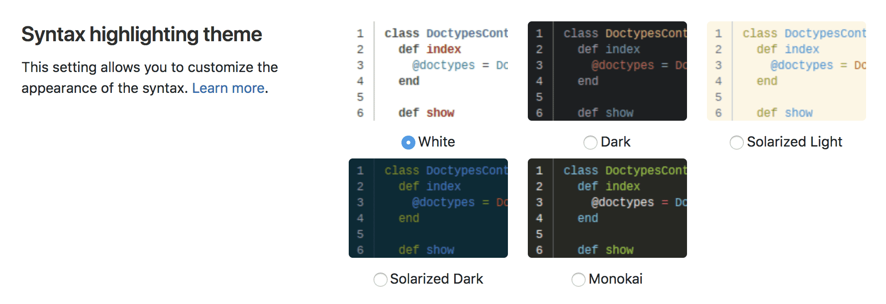

# Profile preferences

A user's profile preferences page allows the user to customize various aspects
of GitLab to their liking.

To navigate to your profile's preferences, click your avatar icon in the top
right corner, select **Settings** and then choose **Preferences** from the
left sidebar.

## Navigation theme

The GitLab navigation theme setting allows you to personalize your GitLab experience.
You can choose from several color themes that add unique colors to the top navigation
and left side navigation.
Using individual color themes might help you differentiate between your different
GitLab instances.

The default palette is Indigo. You can choose between 10 different themes:

- Indigo
- Light Indigo
- Blue
- Light Blue
- Green
- Light Green
- Red
- Light Red
- Cyan
- Pink
- Dark
- Light

## Syntax highlighting theme

NOTE: **Note:**
GitLab uses the [rouge Ruby library](http://rouge.jneen.net/ "Rouge website")
for syntax highlighting. For a list of supported languages visit the rouge website.

Changing this setting allows you to customize the color theme when viewing any
syntax highlighted code on GitLab.

The default syntax theme is White, and you can choose among 5 different colors:

- White
- Dark
- Solarized light
- Solarized dark
- Monokai

## Behavior

The following settings allow you to customize the behavior of GitLab's layout
and default views of your dashboard and the projects' landing pages.

### Layout width

GitLab can be set up to use different widths depending on your liking. Choose
between the fixed (max. 1200px) and the fluid (100%) application layout.

### Default dashboard

For users who have access to a large number of projects but only keep up with a
select few, the amount of activity on the default Dashboard page can be
overwhelming. Changing this setting allows you to redefine what your default
dashboard will be.

You have 8 options here that you can use for your default dashboard view:

- Your projects (default)
- Starred projects
- Your projects' activity
- Starred projects' activity
- Your groups
- Your [Todos](../../workflow/todos.md)
- Assigned Issues
- Assigned Merge Requests

### Project overview content

The project overview content setting allows you to choose what content you want to
see on a project’s home page.

You can choose between 3 options:

- Files and Readme (default)
- Readme
- Activity
