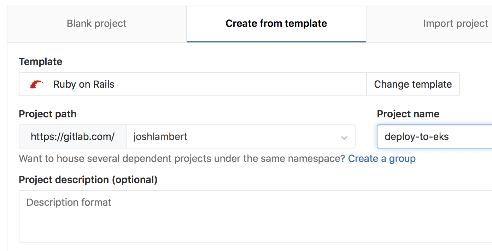
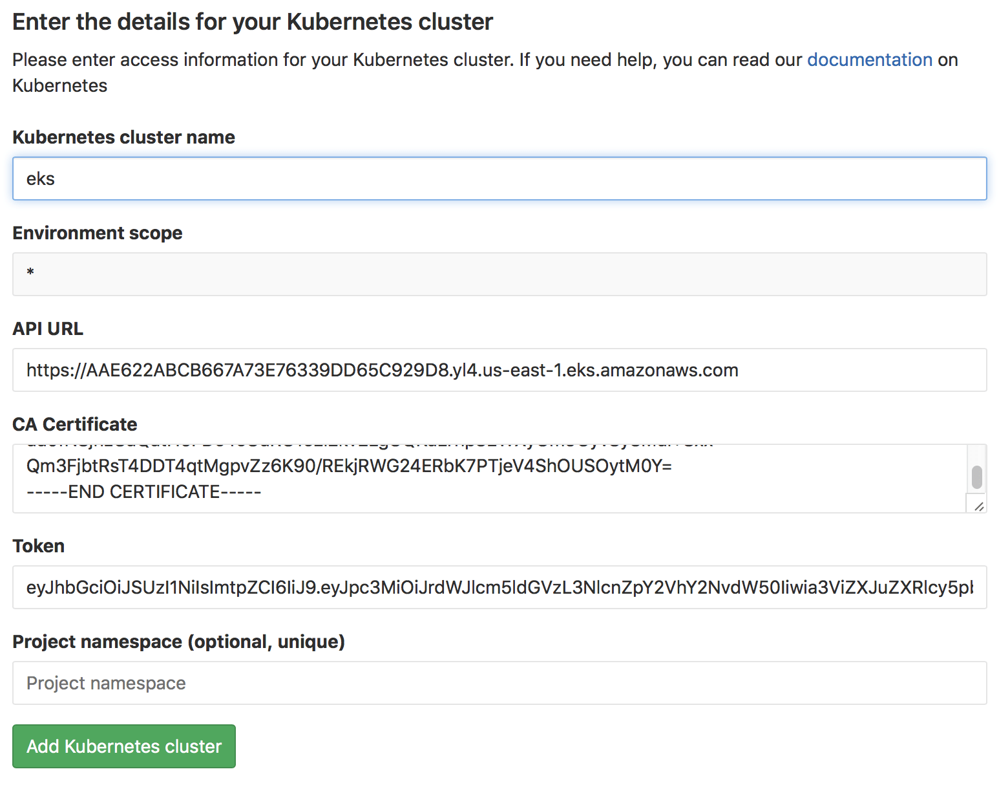
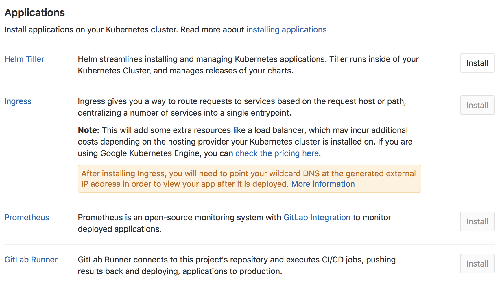

# Connecting and deploying to an Amazon EKS cluster

> **[Article Type](../../../../development/writing_documentation.md#types-of-technical-articles):** tutorial ||
> **Level:** intermediate ||
> **Author:** [Joshua Lambert](https://gitlab.com/joshlambert) ||
> **Publication date:** 2018-06-05

## Introduction

In this tutorial, we will show how easy it is to integrate an [Amazon EKS](https://aws.amazon.com/eks/) cluster with GitLab, and begin deploying applications.

For an end-to-end walkthrough we will:
1. Start with a new project based on the sample Ruby on Rails template
1. Integrate an EKS cluster
1. Utilize [Auto DevOps](../../../../topics/autodevops/) to build, test, and deploy our application

You will need:
1. An account on GitLab, like [GitLab.com](https://gitlab.com)
1. An Amazon EKS cluster
1. `kubectl` [installed and configured for access to the EKS cluster](https://docs.aws.amazon.com/eks/latest/userguide/getting-started.html#get-started-kubectl)

If you don't have an Amazon EKS cluster, one can be created by following [the EKS getting started guide](https://docs.aws.amazon.com/eks/latest/userguide/getting-started.html).

## Creating a new project

On GitLab, create a new project by clicking on the `+` icon in the top navigation bar, and selecting `New project`.


On the new project screen, click on the `Create from template` tab, and select `Use template` for the Ruby on Rails sample project.

Give the project a name, and then select `Create project`.



## Connecting the EKS cluster

From the left side bar, hover over `CI/CD` and select `Kubernetes`, then click on `Add Kubernetes cluster`, and finally `Add an existing Kubernetes cluster`.

A few details from the EKS cluster will be required to connect it to GitLab.

1. A valid Kubernetes certificate and token are needed to authenticate to the EKS cluster. A pair is created by default, which can be used. Open a shell and use `kubectl` to retrieve them:
  * List the secrets with `kubectl get secrets`, and one should named similar to `default-token-xxxxx`. Copy that token name for use below.
  * Get the certificate with `kubectl get secret <secret name> -o jsonpath="{['data']['ca\.crt']}" | base64 -D`
  * Retrieve the token with `kubectl get secret <secret name> -o jsonpath="{['data']['token']}" | base64 -D`.
1. The API server endpoint is also required, so GitLab can connect to the cluster. This is displayed on the AWS EKS console, when viewing the EKS cluster details.

You now have all the information needed to connect the EKS cluster:
* Kubernetes cluster name: Provide a name for the cluster to identify it within GitLab.
* Environment scope: Leave this as `*` for now, since we are only connecting a single cluster.
* API URL: Paste in the API server endpoint retrieved above.
* CA Certificate: Paste the certificate data from the earlier step, as-is.
* Paste the token value. Note on some versions of Kubernetes a trailing `%` is output, do not include it.
* Project namespace: This can be left blank to accept the default namespace, based on the project name.



Click on `Add Kubernetes cluster`, the cluster is now connected to GitLab. At this point, [Kubernetes deployment variables](../#deployment-variables) will automatically be available during CI jobs, making it easy to interact with the cluster.

If you would like to utilize your own CI/CD scripts to deploy to the cluster, you can stop here.

## Disable Role Based0Access Control (RBAC)

Presently, Auto DevOps and one-click app installs do not support [Kubernetes role-based access control](https://kubernetes.io/docs/reference/access-authn-authz/rbac/). Support is [being worked on](https://gitlab.com/groups/gitlab-org/-/epics/136), but in the interim RBAC must be disabled to utilize for these features.

> **Note**: Disabling RBAC means that any application running in the cluster, or user who can authenticate to the cluster, has full API access. This is a [security concern](https://docs.gitlab.com/ee/user/project/clusters/#security-implications), and may not be desirable.

To effectively disable RBAC, global permissions can be applied granting full access:

```bash
kubectl create clusterrolebinding permissive-binding \
  --clusterrole=cluster-admin \
  --user=admin \
  --user=kubelet \
  --group=system:serviceaccounts
```

## Deploy services to the cluster

GitLab supports one-click deployment of helpful services to the cluster, many of which support Auto DevOps. Back on the Kubernetes cluster screen in GitLab, a list of applications is now available to deploy.

First install Helm Tiller, a package manager for Kubernetes. This enables deployment of the other applications.



### Deploying NGINX Ingress (optional)

Next, if you would like the deployed app to be reachable on the internet, deploy the Ingress. Note that this will also cause an [Elastic Load Balancer](https://aws.amazon.com/documentation/elastic-load-balancing/) to be created, which will incur additional AWS costs.

Once installed, you may see a `?` for `Ingress IP Address`. This is because the created ELB is available at a DNS name, not an IP address. To get the DNS name, run: `kubectl get service ingress-nginx-ingress-controller -n gitlab-managed-apps -o jsonpath="{.status.loadBalancer.ingress[0].hostname}"`. Note, you may see a trailing `%` on some Kubernetes versions, do not include it.

The Ingress is now available at this address, and will route incoming requests to the proper service based on the DNS name in the request. To support this, a wildcard DNS CNAME record should be created for the desired domain name. For example `*.myekscluster.com` would point to the Ingress hostname obtained earlier.


### Deploying the GitLab Runner (optional)

If the project is on GitLab.com, free shared runners are available and you do not have to deploy one. If a project specific runner is desired, or there are no shared runners, it is easy to deploy one.

Simply click on the `Install` button for the GitLab Runner. It is important to note that the runner deployed is set as **privileged**, which means it essentially has root access to the underlying machine. This is required to build docker images, and so is on by default.

### Deploying Prometheus (optional)

GitLab is able to monitor applications automatically, utilizing [Prometheus](../../integrations/prometheus.html). Kubernetes container CPU and memory metrics are automatically collected, and response metrics are retrieved from NGINX Ingress as well.

To enable monitoring, simply install Prometheus into the cluster with the `Install` button.

## Create a default Storage Class

Amazon EKS does not have a default Storage Class out of the box, which means requests for persistent volumes will not be automatically fulfilled. As part of Auto DevOps, the deployed Postgres instance requests persistent storage, and without a default storage class it will fail to start.

If a default Storage Class does not already exist and is desired, follow Amazon's [short guide](https://docs.aws.amazon.com/eks/latest/userguide/storage-classes.html) to create one.

Alternatively, disable Postgres by setting the project variable [`POSTGRES_ENABLED`](../../../../topics/autodevops/#environment-variables) to `false`.

## Deploy the app to EKS

With RBAC disabled and services deployed, [Auto DevOps](https://docs.gitlab.com/ee/topics/autodevops/) can now be leveraged to build, test, and deploy the app. To enable, click on `Settings` in the left sidebar, then `CI/CD`. You will see a section for `Auto DevOps`, expand it. Click on the radio button to `Enable Auto DevOps`.

If a wildcard DNS entry was created resolving to the Load Balancer, enter it in the `domain` field. Otherwise, the deployed app will not be externally available outside of the cluster. To save, click `Save changes`.  


A new pipeline will automatically be created, which will begin to build, test, and deploy the app.

After the pipeline has finished, your app will be running in EKS and available to users. Click on `CI/CD` tab in the left navigation bar, and choose `Environments`.


You will see a list of the environments and their deploy status, as well as options to browse to the app, view monitoring metrics, and even access a shell on the running pod.

To learn more about Auto DevOps, review our [documentation](../../../../topics/autodevops/).
