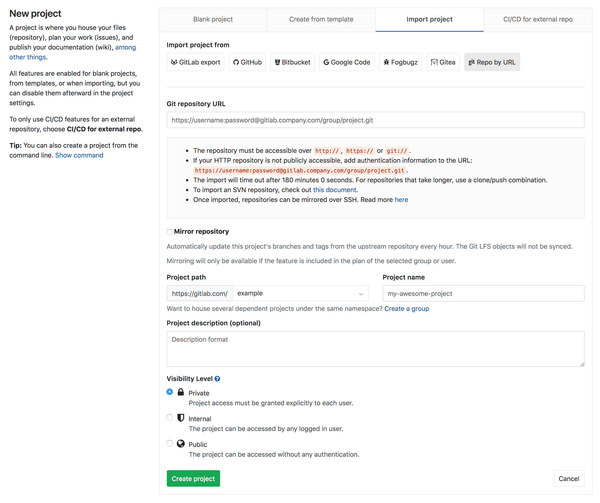

# Import project from repo by URL

You can import your existing repositories by providing the Git URL:

1. From your GitLab dashboard click **New project**
1. Switch to the **Import project** tab
1. Click on the **Repo by URL** button
1. Fill in the "Git repository URL" and the remaining project fields
1. Click **Create project** to being the import process
1. Once complete, you will be redirected to your newly created project

<<<<<<< HEAD

## CI/CD for external repositories

>[Introduced][ee-4642] in [GitLab Premium][eep] 10.6.

Instead of importing the repo directly to GitLab, you can connect your
external repository to get GitLab CI/CD benefits.

This will set up [repository mirroring](../../../workflow/repository_mirroring.md) and create a stripped-down version of a project
that has issues, merge requests, container registry, wiki, and snippets disabled
but [can be re-enabled later on](../settings/index.md#sharing-and-permissions).

1. From your GitLab dashboard click **New project**
1. Switch to the **CI/CD for external repo** tab
1. Follow the same import project steps (see above)

[ee-4642]: https://gitlab.com/gitlab-org/gitlab-ee/merge_requests/4642
[eep]: https://about.gitlab.com/products/
=======
>>>>>>> upstream/master
