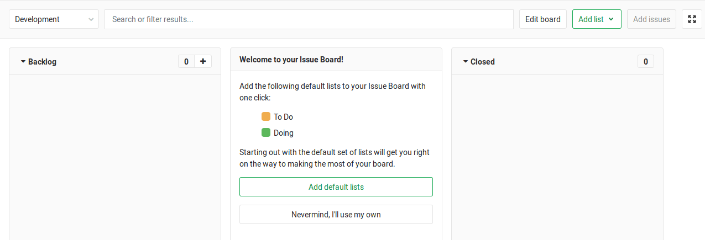
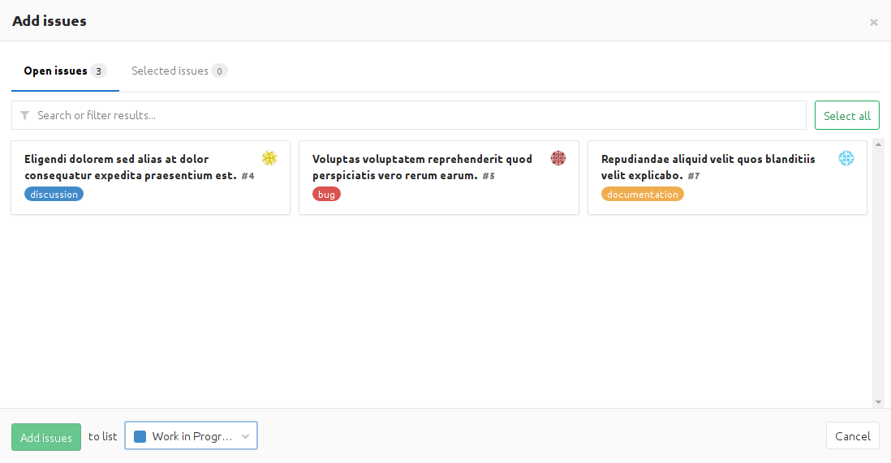

# Issue Board

>**Notes:**
- [Introduced][ce-5554] in GitLab 8.11.
- The Backlog column was replaced by the **Add issues** button in GitLab 8.17.

The GitLab Issue Board is a software project management tool used to plan,
organize, and visualize a workflow for a feature or product release.
It can be seen like a light version of a [Kanban] or a [Scrum] board.

Other interesting links:

- [GitLab Issue Board landing page on about.gitlab.com][landing]
- [YouTube video introduction to Issue Boards][youtube]

## Overview

The Issue Board builds on GitLab's existing issue tracking functionality and
leverages the power of [labels] by utilizing them as lists of the scrum board.

With the Issue Board you can have a different view of your issues while also
maintaining the same filtering and sorting abilities you see across the
issue tracker.

With [Multiple Issue Boards](#multiple-issue-boards), available only in [GitLab
Enterprise Edition](https://about.gitlab.com/gitlab-ee/), your workflow gets
empowered with the ability to create multiple boards per project.

## Use-cases

There are numerous use-cases for Issue Boards, we will just
exemplify with a couple situations.

For a broader use-case, please check the blog post
[GitLab Workflow, an Overview](https://about.gitlab.com/2016/10/25/gitlab-workflow-an-overview/#gitlab-workflow-use-case-scenario).

### Single Board

GitLab Workflow allows you to discuss proposals in issues, categorize them
with labels, and from there organize and prioritize them with Issue Boards.

- For example, let's consider this simplified development workflow:
you have a repository hosting your app's codebase
and your team actively contributing to code. Your backend team starts working a new
implementation, gathers feedback and approval, and pass it to frontend.
From there, when frontend is complete, the new feature
is deployed to staging to be tested. When successful, it goes to production. If we have
the labels "backend", "frontend", "staging", and "production", and an Issue Board with
a list for each, we can:
  - Visualize the entire flow of implementations since the
beginning of the dev lifecycle until deployed to production
  - Prioritize the issues in a list by moving them vertically
  - Move issues between lists to organize them according to the labels you've set

### Multiple Boards

To enhance the workflow exemplified above, with [Multiple Issue Boards](#multiple-issue-boards),
available only in [GitLab Enterprise Edition](https://about.gitlab.com/gitlab-ee/),
each team (frontend and backend) can have their own boards to organize their flow among the
members of their teams. We could have, therefore, three Issue Boards for this case:

  - **Backend**, for the backend team and their own labels and workflow
  - **Frontend**, same as above, for the frontend team
  - **Deployment**, for the entire process (backend > frontend > staging > production)

### Boards for Milestones

From the use-cases above, let's assume that you have now created a milestone per release for
your app. You can create a milestone exclusive for each release, and [associate it with a board](#board-with-a-milestone).
Therefore, you'll have everything organized in a board per release.

### Using Focus Mode

When you are organizing your issues through an Issue Board and want to avoid distractions,
you can use the [Issue Board on Focus Mode](#focus-mode).

## Issue Board terminology

Below is a table of the definitions used for GitLab's Issue Board.

| What we call it  | What it means |
| --------------  | ------------- |
| **Issue Board** | It represents a different view for your issues. It can have multiple lists with each list consisting of issues represented by cards. |
| **List**        | Each label that exists in the issue tracker can have its own dedicated list. Every list is named after the label it is based on and is represented by a column which contains all the issues associated with that label. You can think of a list like the results you get when you filter the issues by a label in your issue tracker. |
| **Card**        | Every card represents an issue and it is shown under the list for which it has a label. The information you can see on a card consists of the issue number, the issue title, the assignee and the labels associated with it. You can drag cards around from one list to another. You can re-order cards within a list. |

There are two types of lists, the ones you create based on your labels, and
two defaults:

- Label list: a list based on a label. It shows all opened issues with that label.
- **Backlog** (default): shows all open issues that does not belong to one of lists. Always appears on the very left.
- **Closed** (default): shows all closed issues. Always appears on the very right.

---

In short, here's a list of actions you can take in an Issue Board:

- [Create a new list](#creating-a-new-list).
- [Delete an existing list](#deleting-a-list).
- Drag issues between lists.
- Re-order issues in lists.
- Drag and reorder the lists themselves.
- Change issue labels on-the-fly while dragging issues between lists.
- Close an issue if you drag it to the **Done** list.
- Create a new list from a non-existing label by [creating the label on-the-fly](#creating-a-new-list)
  within the Issue Board.
- [Filter issues](#filtering-issues) that appear across your Issue Board.

If you are not able to perform one or more of the things above, make sure you
have the right [permissions](#permissions).

## First time using the Issue Board

The first time you navigate to your Issue Board, you will be presented with
a default list (**Done**) and a welcoming message that gives
you two options. You can either create a predefined set of labels and create
their corresponding lists to the Issue Board or opt-out and use your own lists.

If you choose to use and create the predefined lists, they will appear as empty
because the labels associated to them will not exist up until that moment,
which means the system has no way of populating them automatically. That's of
course if the predefined labels don't already exist. If any of them does exist,
the list will be created and filled with the issues that have that label.

## Creating a new list

Create a new list by clicking on the **Add list** button at the upper
right corner of the Issue Board.

Simply choose the label to create the list from. The new list will be inserted
at the end of the lists, before **Done**. Moving and reordering lists is as
easy as dragging them around.

To create a list for a label that doesn't yet exist, simply create the label by
choosing **Create new label**. The label will be created on-the-fly and it will
be immediately added to the dropdown. You can now choose it to create a list.

## Deleting a list

To delete a list from the Issue Board use the small trash icon that is present
in the list's heading. A confirmation dialog will appear for you to confirm.

Deleting a list doesn't have any effect in issues and labels, it's just the
list view that is removed. You can always add it back later if you need.

## Adding issues to a list

You can add issues to a list by clicking the **Add issues** button that is
present in the upper right corner of the Issue Board. This will open up a modal
window where you can see all the issues that do not belong to any list.

Select one or more issues by clicking on the cards and then click **Add issues**
to add them to the selected list. You can limit the issues you want to add to
the list by filtering by author, assignee, milestone and label.

## Removing an issue from a list

Removing an issue from a list can be done by clicking on the issue card and then
clicking the **Remove from board** button in the sidebar. Under the hood, the
respective label is removed, and as such it's also removed from the list and the
board itself.

## Re-ordering an issue in a list

> Introduced in GitLab 9.0.

Issues can be re-ordered inside of lists. This is as simple as dragging and dropping
an issue into the order you want.

## Filtering issues

You should be able to use the filters on top of your Issue Board to show only
the results you want. This is similar to the filtering used in the issue tracker
since the metadata from the issues and labels are re-used in the Issue Board.

You can filter by author, assignee, milestone and label.

## Creating workflows

By reordering your lists, you can create workflows. As lists in Issue Boards are
based on labels, it works out of the box with your existing issues. So if you've
already labeled things with 'Backend' and 'Frontend', the issue will appear in
the lists as you create them. In addition, this means you can easily move
something between lists by changing a label.

A typical workflow of using the Issue Board would be:

1. You have [created][create-labels] and [prioritized][label-priority] labels
   so that you can easily categorize your issues.
1. You have a bunch of issues (ideally labeled).
1. You visit the Issue Board and start [creating lists](#creating-a-new-list) to
   create a workflow.
1. You move issues around in lists so that your team knows who should be working
   on what issue.
1. When the work by one team is done, the issue can be dragged to the next list
   so someone else can pick up.
1. When the issue is finally resolved, the issue is moved to the **Done** list
   and gets automatically closed.

For instance you can create a list based on the label of 'Frontend' and one for
'Backend'. A designer can start working on an issue by adding it to the
'Frontend' list. That way, everyone knows that this issue is now being
worked on by the designers. Then, once they're done, all they have to do is
drag it over to the next list, 'Backend', where a backend developer can
eventually pick it up. Once they’re done, they move it to **Done**, to close the
issue.

This process can be seen clearly when visiting an issue since with every move
to another list the label changes and a system not is recorded.

## Multiple Issue Boards

> Introduced in [GitLab Enterprise Edition][ee] 8.13.

Multiple Issue Boards, as the name suggests, allow for more than one Issue Board
for a given project. This is great for large projects with more than one team
or in situations where a repository is used to host the code of multiple
products.

Clicking on the current board name in the upper left corner will reveal a
menu from where you can create another Issue Board and rename or delete the
existing one.

### Board with a milestone

> Introduced in [GitLab Enterprise Edition][ee] 9.0.

An Issue Board can be associated with a GitLab [Milestone](milestones/index.md#milestones)
which will automatically filter the issue to that milestone. This allows you to
create unique boards for individual milestones.

You can assign a milestone to a board when creating a new Issue Board or you
can update current Issue Boards to also have a milestone. Once a specific
milestone is assigned to an Issue Board, you will no longer be able to filter
through any other milestone. In order to do that, you need to remove the
defined milestone from the Issue Board.

There are also two pre-defined milestones, **Any milestone** which will filter
the issues with any milestone, and **Upcoming** which will filter issues to the
milestone with the due date that is next.

## Focus mode

Click the button at the top right to toggle focus mode on and off. In focus mode, the navigation UI is hidden, allowing you to focus on issues in the board.

## Permissions

[Developers and up](../permissions.md) can use all the functionality of the
Issue Board, that is create/delete lists and drag issues around.

## Tips

A few things to remember:

- The label that corresponds to a list is hidden for issues under that list.
- Moving an issue between lists removes the label from the list it came from
  and adds the label from the list it goes to.
- When moving a card to **Done**, the label of the list it came from is removed
  and the issue gets closed.
- An issue can exist in multiple lists if it has more than one label.
- Lists are populated with issues automatically if the issues are labeled.
- Clicking on the issue title inside a card will take you to that issue.
- Clicking on a label inside a card will quickly filter the entire Issue Board
  and show only the issues from all lists that have that label.
- For performance and visibility reasons, each list shows the first 20 issues
  by default. If you have more than 20 issues start scrolling down and the next
  20 will appear.

[ce-5554]: https://gitlab.com/gitlab-org/gitlab-ce/merge_requests/5554
[ee]: https://about.gitlab.com/gitlab-ee/
[labels]: ./labels.md
[scrum]: https://en.wikipedia.org/wiki/Scrum_(software_development)
[kanban]: https://en.wikipedia.org/wiki/Kanban_(development)
[create-labels]: ./labels.md#create-new-labels
[label-priority]: ./labels.md#prioritize-labels
[landing]: https://about.gitlab.com/solutions/issueboard
[youtube]: https://www.youtube.com/watch?v=UWsJ8tkHAa8
