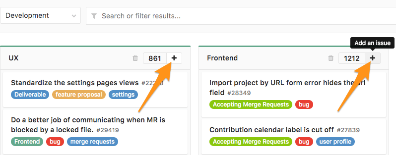

# Create a new Issue

Please read through the [GitLab Issue Documentation](index.md) for an overview on GitLab Issues.

When you create a new issue, you'll be prompted to fill in
the information illustrated on the image below.

Read through the [issues functionalities documentation](issues_functionalities.md#issues-functionalities)
to understand these fields one by one.

## New issue from the Issue Tracker

Navigate to your **Project's Dashboard** > **Issues** > **New Issue** to create a new issue:

## New issue from an opened issue

From an **opened issue** in your project, click **New Issue** to create a new
issue in the same project:

## New issue from the project's dashboard

From your **Project's Dashboard**, click the plus sign (**+**) to open a dropdown
menu with a few options. Select **New Issue** to create an issue in that project:

## New issue from the Issue Board

From an Issue Board, create a new issue by clicking on the plus sign (**+**) on the top of a list.
It opens a new issue for that project labeled after its respective list.

## New issue via email

*This feature needs [incoming email](../../../administration/incoming_email.md)
to be configured by a GitLab administrator to be available for CE/EE users, and
it's available on GitLab.com.*

At the bottom of a project's issue page, click
**Email a new issue to this project**, and you will find an email address
which belongs to you. You could add this address to your contact.

This is a private email address, generated just for you.
**Keep it to yourself** as anyone who gets ahold of it can create issues or
merge requests as if they were you. You can add this address to your contact
list for easy access.

Sending an email to this address will create a new issue on your behalf for
this project, where the email subject becomes the issue title, and the email
body becomes the issue description. [Markdown] and [quick actions] are
supported.

<<<<<<< HEAD
## New issue via Service Desk **[PREMIUM]**

Enable [Service Desk](../service_desk.md) to your project and offer email support.
By doing so, when your customer sends a new email, a new issue can be created in
the appropriate project and followed up from there.

## New issue from the group-level Issue Tracker

Head to the Group dashboard and click "Issues" in the sidebar to visit the Issue Tracker
for all projects in your Group. Select the project you'd like to add an issue for
using the dropdown button at the top-right of the page.

We'll keep track of the project you selected most recently, and use it as the default
for your next visit. This should save you a lot of time and clicks, if you mostly
create issues for the same project.

=======
>>>>>>> upstream/master
## New issue via URL with prefilled fields

You can link directly to the new issue page for a given project, with prefilled
field values using query string parameters in a URL. This is useful for embedding 
a URL in an external HTML page, and also certain scenarios where you want the user to 
create an issue with certain fields prefilled.

The title, description, and description template fields can be prefilled using 
this method. The description and description template fields cannot be pre-entered
in the same URL (since a description template just populates the description field).

Follow these examples to form your new issue URL with prefilled fields.

- For a new issue in the GitLab Community Edition project with a pre-entered title
and a pre-entered description, the URL would be `https://gitlab.com/gitlab-org/gitlab-ce/issues/new?issue[title]=Validate%20new%20concept&issue[description]=Research%20idea`
- For a new issue in the GitLab Community Edition project with a pre-entered title
and a pre-entered description template, the URL would be `https://gitlab.com/gitlab-org/gitlab-ce/issues/new?issue[title]=Validate%20new%20concept&issuable_template=Research%20proposal`
<<<<<<< HEAD

[Markdown]: ../../markdown.md
[quick actions]: ../quick_actions.md
=======
>>>>>>> upstream/master
