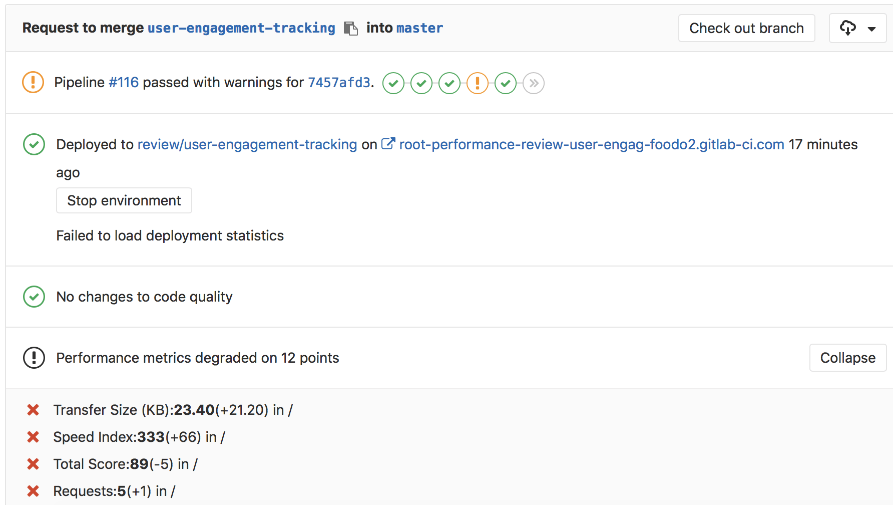

# Browser Performance Testing

> [Introduced](https://gitlab.com/gitlab-org/gitlab-ee/merge_requests/3507) in [GitLab Enterprise Edition Premium](https://about.gitlab.com/gitlab-ee/) 10.3.

## Overview

If your application offers a web interface and you are using [GitLab CI/CD](../../../ci/README.md), you can quickly determine the performance impact of pending code changes. GitLab uses [Sitespeed.io](https://www.sitespeed.io), a free and open source tool for measuring the performance of web sites, to analyze the performance of specific pages.

GitLab runs the [Sitespeed.io container](https://hub.docker.com/r/sitespeedio/sitespeed.io/) and compares the overall scores for each page between the source and target branches of a merge request. The difference for each page is then shown right on the merge request:

## Use cases

For instance, consider the following workflow:

1. A member of the marketing team is attempting to track engagement by adding a new tool
1. With browser performance metrics, they see how their changes are impacting the usability of the page for end users
1. The metrics show that after their changes the performance score of the page has gone down
1. When looking at the detailed report, they see that the new Javascript library was included in `<head>` which affects loading page speed
1. They ask a front end developer to help them, who sets the library to load asynchronously
1. The frontend developer approves the merge request and authorizes its deployment to production

## How it works

In order to easily consume the Sitespeed results across multiple pages, GitLab has built a simple [Sitespeed plugin](https://gitlab.com/gitlab-org/gl-performance) which outputs `performance.json`. This plugin outputs the performance score for each page that is analyzed. [Additional metrics](https://gitlab.com/gitlab-org/gitlab-ee/issues/4370) are planned to be supported in a future release.

In order for the report to show in the merge request, you need to specify a
`performance` job (exact name) that will analyze the code and upload the resulting
`performance.json` as an artifact. GitLab will then check this file and show
the information inside the merge request.

Presently `performance.json` needs to be the only artifact file for the job. We are working on adding support to be able to [include other artifact files](https://gitlab.com/gitlab-org/gitlab-ee/issues/2877), like the broader HTML report, in a subsequent release.

If the performance report doesn't have anything to compare to, no information
will be displayed in the merge request area. That is the case when you add the
`performance` job in your `.gitlab-ci.yml` for the very first time.
Consecutive merge requests will have something to compare to and the performance
report will be shown properly.

For more information on how the `performance` job should look, check the
example on [analyzing a project's performance with Sitespeed.io](../../../ci/examples/browser_performance.md).
