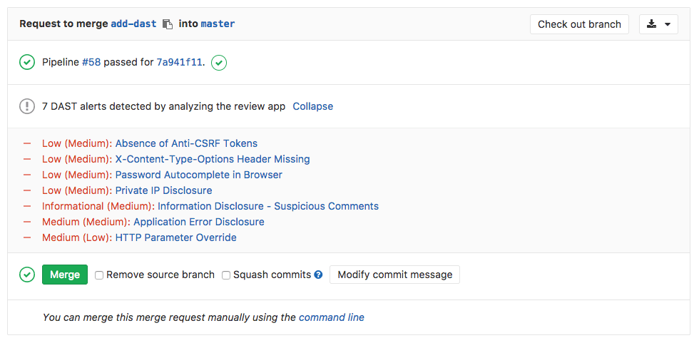

# Dynamic Application Security Testing (DAST)

> [Introduced][ee-4348] in [GitLab Ultimate][ee] 10.4.

If you are using [GitLab CI/CD][ci], you can analyze your running web application(s)
for known vulnerabilities using Dynamic Application Security Testing (DAST).

## Overview

Running [static checks](sast.md) on your code is the first step to detect
vulnerabilities that can put the security of your code at risk. Yet, once
deployed, your application is exposed to a new category of possible attacks,
such as cross-site scripting or broken authentication flaws. This is where
Dynamic Application Security Testing (DAST) comes into place.

You can take advantage of DAST by either [including the CI job][cc-docs] in
your existing `.gitlab-ci.yml` file or by implicitly using
[Auto DAST](../../../topics/autodevops/index.md#auto-dast)
that is provided by [Auto DevOps](../../../topics/autodevops/index.md).

Going a step further, GitLab can show the vulnerability list right in the merge
request widget area.

## Use cases

It helps you automatically find security vulnerabilities in your running web
applications while you are developing and testing your applications.

## How it works

First of all, you need to define a job named `dast` in your `.gitlab-ci.yml`
file. [Check how the `dast` job should look like][cc-docs].

In order for the report to show in the merge request, there are two
prerequisites:

- the specified job **must** be named `dast`
- the resulting report **must** be named `gl-dast-report.json` and uploaded as an
  artifact. This JSON file needs to be the only artifact file for the job. If
  you try to also include other files, it will break the vulnerability display
  in the merge request.

The `sast` job will perform an analysis on the running web application, the
resulting JSON file will be uploaded as an artifact, and GitLab will then check
this file and show the information inside the merge request.

By clicking on one of the detected linked vulnerabilities, you will be able to
see the details and the URL(s) affected.

[ee-4348]: https://gitlab.com/gitlab-org/gitlab-ee/issues/4348
[ee]: https://about.gitlab.com/gitlab-ee/
[ci]: ../../../ci/README.md
[cc-docs]: ../../../ci/examples/dast.md
