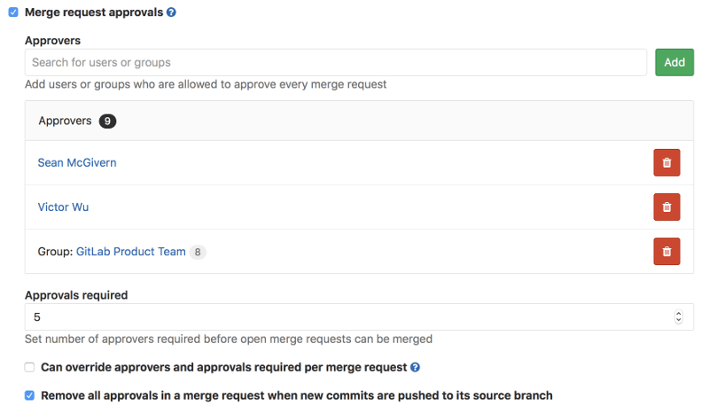

# Merge request approvals

> Introduced in [GitLab Enterprise Edition 7.12](https://about.gitlab.com/2015/06/22/gitlab-7-12-released/#merge-request-approvers-ee-only), available in [GitLab Starter](https://about.gitlab.com/products/).

## Overview

Merge request approvals enable enforced code review by requiring specified people to approve a merge request before it can be unblocked for merging.

## Use cases

1. Enforcing review of all code that gets merged into a repository.
2. Specifying code maintainers for an entire repository.
3. Specifying reviewers for a given proposed code change.
4. Specifying categories of reviewers, such as BE, FE, QA, DB, etc. for all proposed code changes.

## Approve and remove approval

If approvals are activated for the given project, when a user visits an open merge request, depending on their eligiblity, one of the following is possible:

- They are not an eligible approver. (See below for eligibility conditions.) They cannot do anything with repsect to approving this merge request.
- They have already approved this merge request. They can remove their approval.
- They have not approved this merge request.
  - The required number of approvals has not been yet met. They can approve it by clicking the displayed `Approve` button.
  - The required number of approvals has already been met. They can still approve it by clicking the displayed `Approve additionally` button.

  

## Unblocked merge request

Suppose approvals are activated for the given project. For the given merge request, if the required number of approvals has been met (i.e. the number of approvals given to the merge request is greater or equal than the required number), then the merge request is unblocked for merging. Meeting the required number of approvals is a necessary but not sufficient condition for unblocking a merge request from being merged. There are other conditions that may block it.

## Project-level configuration

### Activate

Actiate approvals by checking the checkbox.

### Required number of approvals

Enter the required number of approvals to unblock the merge request from being merged. Call this number `m`.

### Configure individual approvers

Select individual users who are eligible approvers for merge requests in this project. You can only select project members, members of the project's immediate parent group, and members of a group who have access to the project via a [share](../../../workflow/share_projects_with_other_groups.md).

### Configure group approvers

Select groups who are eligible approvers. Members of these groups will be eligible approvers for merge requests in this project.

### Eligible approvers

For a given merge request in the given project, suppose there are no additional approvals configuration in the merge request itself (below). Then for that merge request, the set of explicit approvers is the `union` of the following two

  - The individual approvers
  - The members of the group approvers

minus the merge request author. (We don't allow the merge request author to approve their own merge request.) Call this set `Ω`. Note that the `union` operator unravels groups and eliminates duplicates. So if the same user is configured as an individual approver and also part of a group approver, then that user is just counted once in `Ω`.

If `m <= count(Ω)`, then only users in `Ω` are eligible appovers of the merge request.

If `m > count(Ω)`, then users in `Ω` _and_ members of the given project with Developer role or higher (minus the merge request author) are eligible approvers of the merge request.

## Merge request-level configuration

If approvers are activated at the project level, configuration can be overriden for each merge request in that project, provided that the associated configuration is checked.

### Required number of approvals

Enter the required number of approvals to unblock the merge request from being merged. Call this number `m'`, which must be greater than or equal to `m`.

### Configure individual approvers

Select individual users who are eligible approvers for this merge request. You can only select project members, members of the project's immediate parent group, and members of a group who have access to the project via a [share](../../../workflow/share_projects_with_other_groups.md).

### Configure group approvers

Select groups who are eligible approvers for this merge request. Members of these groups will be eligible approvers for this merge request.

### Eligible approvers

For this merge request, the set of explicit approvers is the `union` of the following three:

  - `Ω`
  - The individual approvers at the merge request
  - The members of the group approvers at the merge request

minus the merge request author. (We don't allow the merge request author to approve their own merge request.) Call this set `Ω'`. Note that the `union` operator unravels groups and eliminates duplicates. So if the same user is configured as an individual approver and also part of a group approver, then that user is just counted once in `Ω'`.

If `m' <= count(Ω')`, then only users in `Ω'` are eligible appovers of the merge request.

If `m' > count(Ω')`, then users in `Ω'` _and_ members of the given project with Developer role or higher (minus the merge request author) are eligible approvers of the merge request.

## Remove approvals when new commits are pushed

If this project configuration is checked, all approvals on a merge request are removed when new commits are pushed to the source branch of the merge request; except for when you rebase the merge request directly from the merge request UI by clicking the `Rebase` button.

