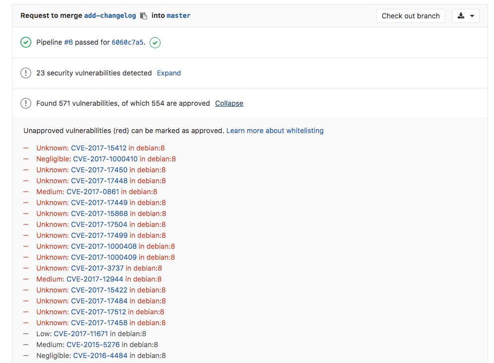

# Static Application Security Testing (SAST)

> [Introduced][ee-3781] in [GitLab Enterprise Edition Ultimate][ee] 10.4.

## Overview

If you are using [GitLab CI/CD][ci], you can analyze your docker for known
vulnerabilities using [Clair](https://github.com/coreos/clair), 
a Vulnerability Static Analysis for Containers.

Going a step further, GitLab can show the vulnerability list right in the merge
request widget area:

## Use cases

TODO: write

## How it works

In order for the report to show in the merge request, you need to specify a
`sast:image` job (exact name) that will analyze the code and upload the resulting
`gl-sast-image-report.json` file as an artifact. GitLab will then check this file and
show the information inside the merge request.

This JSON file needs to be the only artifact file for the job. If you try
to also include other files, it will break the vulnerability display in the
merge request.

For more information on how the `sast:image` job should look like, check the
example on [analyzing a project's code for vulnerabilities][cc-docs].

[ee-3781]: https://gitlab.com/gitlab-org/gitlab-ee/issues/3781
[ee]: https://about.gitlab.com/gitlab-ee/
[ci]: ../../../ci/README.md
[cc-docs]: ../../../ci/examples/sast.md
