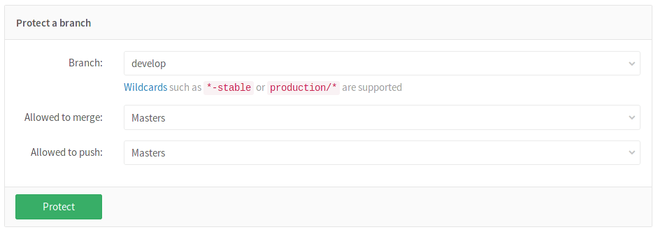

# Protected Branches

[Permissions](../permissions.md) in GitLab are fundamentally defined around the
idea of having read or write permission to the repository and branches. To
prevent people from messing with history or pushing code without review, we've
created protected branches.

A protected branch does four simple things:

- it prevents its creation, if not already created, from everybody except users
  with Master permission (or developers if configured)
- it prevents pushes from everybody except users with Master permission (or
  developers if configured)
- it prevents **anyone** from force pushing to the branch
- it prevents **anyone** from deleting the branch

## Configuring protected branches

To protect a branch, you need to have at least Master permission level. The
master branch is protected by default.

1. Navigate to the main page of the project.
1. In the upper right corner, click the settings wheel and select **Protected branches**.

    

1. From the **Branch** dropdown menu, select the branch you want to protect and
   click **Protect**.

    

1. Once done, the protected branch will appear in the "Already protected" list.

    

---

Some workflows, like the [GitLab workflow](../../workflow/gitlab_flow.md),
require all users with write access to submit a Merge request in order to get
the changes into a protected branch. Since Masters and Owners can already push
to protected branches, that means Developers cannot push to them and need to
submit a Merge request.

However, there are workflows where that is not needed, and only protecting from
force pushes and branch removal is useful. For those workflows, you can allow
everyone with write access to push to a protected branch by selecting the
"Developers can push" check box.

You can set this option while creating a protected branch or afterwards by
selecting the "Developers can push" check box.

## Wildcard protected branches

>**Note:**
This feature was [introduced][ce-4665] in GitLab 8.10.

You can specify a wildcard protected branch, which will protect all branches
matching the wildcard. For example:

| Wildcard Protected Branch | Matching Branches                                      |
|---------------------------+--------------------------------------------------------|
| `*-stable`                | `production-stable`, `staging-stable`                  |
| `production/*`            | `production/app-server`, `production/load-balancer`    |
| `*gitlab*`                | `gitlab`, `gitlab/staging`, `master/gitlab/production` |

Protected branch settings (like "Developers can push") apply to all matching
branches.

Two different wildcards can potentially match the same branch. For example,
`*-stable` and `production-*` would both match a `production-stable` branch.
In that case, if _any_ of these protected branches have "Developers can push"
set to true, then `production-stable` will also have set to true.

If you click on a protected branch's name, you will be presented with a list of
all matching branches:

## Restrict the creation of protected branches

[ce-4665]: https://gitlab.com/gitlab-org/gitlab-ce/merge_requests/4665
