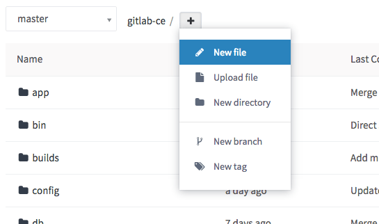
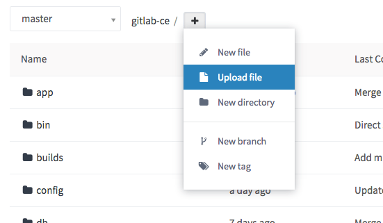
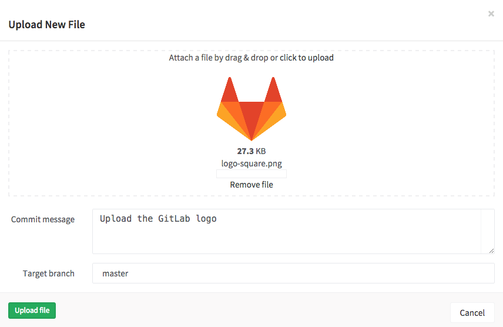
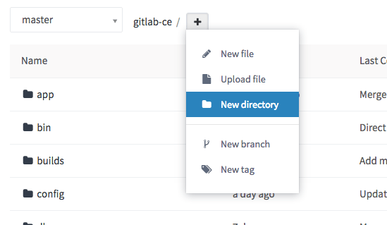
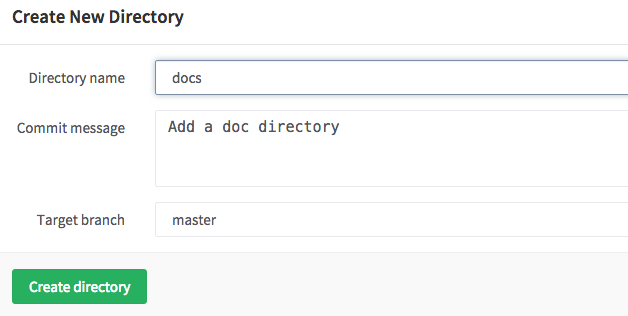
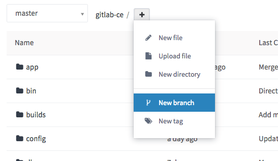
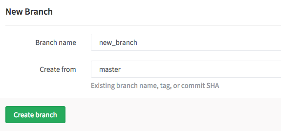
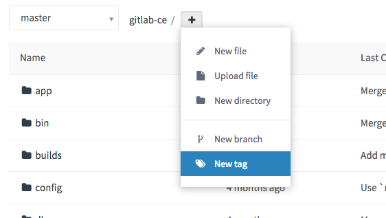

# GitLab Web Editor

Sometimes it's easier to make quick changes directly from the GitLab interface
than to clone the project and use the Git command line tool. In this feature
highlight we look at how you can create a new file, directory, branch or
tag from the file browser. All of these actions are available from a single
dropdown menu.

## Create a file

From a project's files page, click the '+' button to the right of the branch selector.
Choose **New file** from the dropdown.

---

Enter a file name in the **File name** box. Then, add file content in the editor
area. Add a descriptive commit message and choose a branch. The branch field
will default to the branch you were viewing in the file browser. If you enter
a new branch name, a checkbox will appear allowing you to start a new merge
request after you commit the changes.

When you are satisfied with your new file, click **Commit Changes** at the bottom.

### Template dropdowns

When starting a new project, there are some common files which the new project
might need too. Therefore a message will be displayed by GitLab to make this
easy for you.

When clicking on either `LICENSE` or `.gitignore`, a dropdown will be displayed
to provide you with a template which might be suitable for your project.

The license, changelog, contribution guide, or `.gitlab-ci.yml` file could also
be added through a button on the project page. In the example below the license
has already been created, which creates a link to the license itself.

>**Note:**
The **Set up CI** button will not appear on an empty repository. You have to at
least add a file in order for the button to show up.

## Upload a file

The ability to create a file is great when the content is text. However, this
doesn't work well for binary data such as images, PDFs or other file types. In
this case you need to upload a file.

From a project's files page, click the '+' button to the right of the branch
selector. Choose **Upload file** from the dropdown.

---

Once the upload dialog pops up there are two ways to upload your file. Either
drag and drop a file on the pop up or use the **click to upload** link. A file
preview will appear once you have selected a file to upload.

Enter a commit message, choose a branch, and click **Upload file** when you are
ready.

## Create a directory

To keep files in the repository organized it is often helpful to create a new
directory.

From a project's files page, click the '+' button to the right of the branch selector.
Choose **New directory** from the dropdown.

---

In the new directory dialog enter a directory name, a commit message and choose
the target branch. Click **Create directory** to finish.

## Create a new branch

There are multiple ways to create a branch from GitLab's web interface.

### Create a new branch from an issue

> [Introduced][ce-2808] in GitLab 8.6.

In case your development workflow dictates to have an issue for every merge
request, you can quickly create a branch right on the issue page which will be
tied with the issue itself. You can see a **New Branch** button after the issue
description, unless there is already a branch with the same name or a referenced
merge request.

Once you click it, a new branch will be created that diverges from the default
branch of your project, by default `master`. The branch name will be based on
the title of the issue and as suffix it will have its ID. Thus, the example
screenshot above will yield a branch named
`2-et-cum-et-sed-expedita-repellat-consequatur-ut-assumenda-numquam-rerum`.

After the branch is created, you can edit files in the repository to fix
the issue. When a merge request is created based on the newly created branch,
the description field will automatically display the [issue closing pattern]
`Closes #ID`, where `ID` the ID of the issue. This will close the issue once the
merge request is merged.

### Create a new branch from a project's dashboard

If you want to make changes to several files before creating a new merge
request, you can create a new branch up front. From a project's files page,
choose **New branch** from the dropdown.

---

Enter a new **Branch name**. Optionally, change the **Create from** field
to choose which branch, tag or commit SHA this new branch will originate from.
This field will autocomplete if you start typing an existing branch or tag.
Click **Create branch** and you will be returned to the file browser on this new
branch.

---

You can now make changes to any files, as needed. When you're ready to merge
the changes back to master you can use the widget at the top of the screen.
This widget only appears for a period of time after you create the branch or
modify files.

## Create a new tag

Tags are useful for marking major milestones such as production releases,
release candidates, and more. You can create a tag from a branch or a commit
SHA. From a project's files page, choose **New tag** from the dropdown.

---

Give the tag a name such as `v1.0.0`. Choose the branch or SHA from which you
would like to create this new tag. You can optionally add a message and
release notes. The release notes section supports markdown format and you can
also upload an attachment. Click **Create tag** and you will be taken to the tag
list page.

## Tips

When creating or uploading a new file, or creating a new directory, you can
trigger a new merge request rather than committing directly to master. Enter
a new branch name in the **Target branch** field. You will notice a checkbox
appear that is labeled **Start a new merge request with these changes**. After
you commit the changes you will be taken to a new merge request form.

[ce-2808]: https://gitlab.com/gitlab-org/gitlab-ce/merge_requests/2808
[issue closing pattern]: ../administration/issue_closing.md
