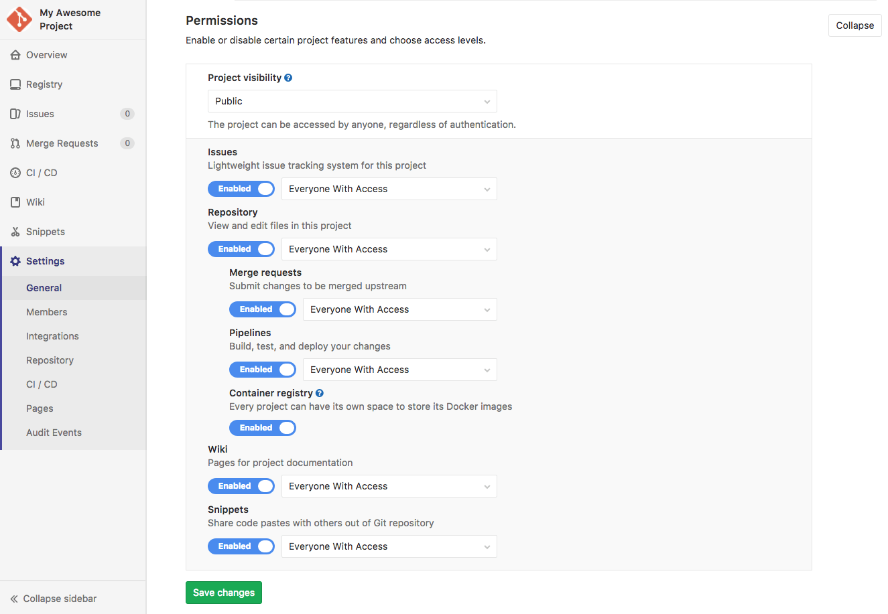

# Project settings

NOTE: **Note:**
Only project Masters and Admin users have the [permissions] to access a project
settings.

You can adjust your [project](../index.md) settings by navigating
to your project's homepage and clicking **Settings**.

## General settings

Under a project's general settings you can find everything concerning the
functionality of a project.

### General project settings

Adjust your project's name, description, avatar, [default branch](../repository/branches/index.md#default-branch), and tags:

### Sharing and permissions

Set up your project's access, [visibility](../../../public_access/public_access.md), and enable [Container Registry](../container_registry.md) for your projects:

### Issue settings

Add an [issue description template](../description_templates.md#description-templates) to your project, so that every new issue will start with a custom template.

### Merge request settings

Set up your project's merge request settings:

- Set up the merge request method (merge commit, [fast-forward merge](../merge_requests/fast_forward_merge.html)).
- Merge request [description templates](../description_templates.md#description-templates).
- Enable [merge request approvals](https://docs.gitlab.com/ee/user/project/merge_requests/merge_request_approvals.html#merge-request-approvals), _available in [GitLab Starter](https://about.gitlab.com/gitlab-ee/)_.
- Enable [merge only of pipeline succeeds](../merge_requests/merge_when_pipeline_succeeds.md).
- Enable [merge only when all discussions are resolved](../../discussions/index.md#only-allow-merge-requests-to-be-merged-if-all-discussions-are-resolved).

### Service Desk

Enable [Service Desk](https://docs.gitlab.com/ee/user/project/service_desk.html) for your project to offer customer support. Service Desk is available in [GitLab Enterprise Edition Premium](https://about.gitlab.com/gitlab-ee/).

### Export project

Learn how to [export a project](import_export.md#importing-the-project) in GitLab.

### Advanced settings

Here you can run housekeeping, archive, rename, transfer, or remove a project.

#### Archiving a project

NOTE: **Note:**
Only project Owners and Admin users have the [permissions] to archive a project.

An archived project will be hidden by default in the project listings.

1. Navigate to your project's **Settings > General > Advanced settings**.
1. Under "Archive project", hit the **Archive project** button.
1. Confirm the action when asked to.

An archived project can be fully restored and will therefore retain its
repository and all associated resources whilst in an archived state.

#### Renaming a repository

NOTE: **Note:**
Only project Masters and Admin users have the [permissions] to rename a
repository. Not to be confused with a project's name where it can also be
changed from the [general project settings](#general-project-settings).

A project's repository name defines its URL (the one you use to access the
project via a browser) and its place on the file disk where GitLab is installed.

To rename a repository:

1. Navigate to your project's **Settings > General > Advanced settings**.
1. Under "Rename repository", change the "Path" to your liking.
1. Hit **Rename project**.

Remember that this can have unintended side effects since everyone with the
old URL will not be able to push or pull. Read more about what happens with the
[redirects when renaming repositories](../index.md#redirects-when-changing-repository-paths).

#### Transferring an existing project into another namespace

NOTE: **Note:**
Only project Owners and Admin users have the [permissions] to transfer a project.

You can transfer an existing project into a [group](../../group/index.md) if:

1. you have at least **Master** [permissions] to that group
1. you are an **Owner** of the project.

Similarly, if you are an owner of a group, you can transfer any of its projects
under your own user.

To transfer a project:

1. Navigate to your project's **Settings > General > Advanced settings**.
1. Under "Transfer project", choose the namespace you want to transfer the
   project to.
1. Confirm the transfer by typing the project's path as instructed.

Once done, you will be taken to the new project's namespace. At this point,
read what happens with the
[redirects from the old project to the new one](../index.md#redirects-when-changing-repository-paths).

NOTE: **Note:**
GitLab administrators can use the admin interface to move any project to any
namespace if needed.

[permissions]: ../../permissions.md##project-members-permissions
