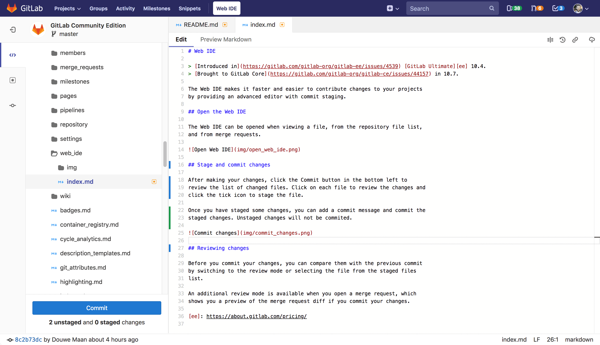

# Web IDE

> [Introduced in](https://gitlab.com/gitlab-org/gitlab-ee/issues/4539) [GitLab Ultimate][ee] 10.4.
> [Brought to GitLab Core](https://gitlab.com/gitlab-org/gitlab-ce/issues/44157) in 10.7.

The Web IDE editor makes it faster and easier to contribute changes to your
projects by providing an advanced editor with commit staging.

## Enable the Web IDE

While in the early stages of the Beta, access to the Web IDE is by opting in.

To enable the Web IDE, click on your profile image in the top right corner and
navigate to **Settings > Preferences**, check **Enable Web IDE** and save.

## Open the Web IDE

The Web IDE can be opened when viewing a file, from the repository file list,
and from merge requests.

## Commit changes

Changed files are shown on the right in the commit panel. All changes are
automatically staged. To commit your changes, add a commit message and click
the 'Commit Button'.

## Comparing changes

Before you commit your changes, you can compare them with the previous commit
by switching to the review mode or selecting the file from the staged files
list.

An additional review mode is available when you open a merge request, which
shows you a preview of the merge request diff if you commit your changes.

[ee]: https://about.gitlab.com/pricing/
