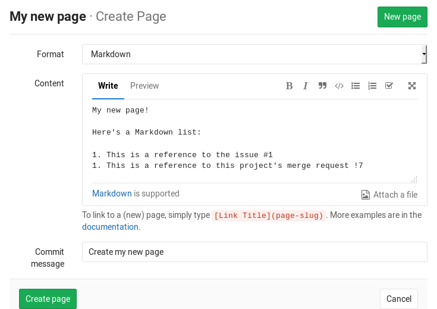

# Wiki

A separate system for documentation called Wiki, is built right into each
GitLab project. It is enabled by default on all new projects and you can find
it under **Wiki** in your project.

Wikis are very convenient if you don't want to keep you documentation in your
repository, but you do want to keep it in the same project where your code
resides.

You can create Wiki pages in the web interface or
[locally using Git](#adding-and-editing-wiki-pages-locally) since every Wiki is
a separate Git repository.

>**Note:**
A [permission level][permissions] of **Guest** is needed to view a Wiki and
**Developer** is needed to create and edit Wiki pages.

## First time creating the Home page

The first time you visit a Wiki, you will be directed to create the Home page.
The Home page is necessary to be created since it serves as the landing page
when viewing a Wiki. You only have to fill in the **Content** section and click
**Create page**. You can always edit it later, so go ahead and write a welcome
message.

Read more in the [Creating a new wiki page](#creating-a-new-wiki-page) section.

## Creating a new wiki page

In the web interface the commit message is optional, but the GitLab Wiki is
based on Git and needs a commit message, so one will be created for you if you
do not enter one.

## Editing a wiki page

## Deleting a wiki page

## Viewing a list of all created wiki pages

## Viewing the history of a wiki page

## Using different markup languages

## Adding and editing wiki pages locally

## Disabling the wiki from your project

[permissions]: ../../permissions.md
