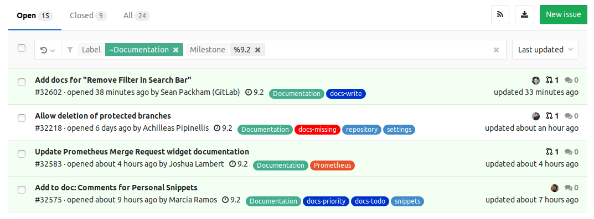

# Search through GitLab

## Issues and merge requests

To search through issues and merge requests in multiple projects, you can use the left-sidebar.

Click the menu bar, then **Issues** or **Merge Requests**, which work in the same way,
therefore, the following notes are valid for both.

The number displayed on their right represents the number of issues and merge requests assigned to you.

When you click **Issues**, you'll see the opened issues assigned to you straight away:

You can filter them by **Author**, **Assignee**, **Milestone**, and **Labels**,
searching through **Open**, **Closed**, and **All** issues.

Of course, you can combine all filters together.

### Issues and MRs assigned to you or created by you

You'll find a shortcut to issues and merge requests create by you or assigned to you
on the search field on the top-right of your screen:

## Issues and merge requests per project

If you want to search for issues present in a specific project, navigate to
a project's **Issues** tab, and click on the field **Search or filter results...**. It will
display a dropdown menu, from which you can add filters per author, assignee, milestone, label,
and weight. When done, press **Enter** on your keyboard to filter the issues.

The same process is valid for merge requests. Navigate to your project's **Merge Requests** tab,
and click **Search or filter results...**. Merge requests can be filtered by author, assignee,
milestone, and label.

## Search history

You can view recent searches by clicking on the little arrow-clock icon, which is to the left of the search input. Click the search entry to run that search again. This feature is available for issues and merge requests. Searches are stored locally in your browser.

## Removing search filters

Individual filters can be removed by clicking on the filter's (x) button or backspacing. The entire search filter can be cleared by clicking on the search box's (x) button.

## Filtering with multiple filters of the same type

Some filters can be added multiple times. These include but are not limited to assignees and labels. When you filter with these multiple filters of the same type, the AND logic is applied. For example, if you were filtering `assignee:@sam assignee:@sarah`, your results will only include entries whereby the assignees are assigned to both Sam and Sarah are returned.

### Shortcut

You'll also find a shortcut on the search field on the top-right of the project's dashboard to
quickly access issues and merge requests created or assigned to you within that project:

## Todos

Your [todos](../../workflow/todos.md#gitlab-todos) can be searched by "to do" and "done".
You can [filter](../../workflow/todos.md#filtering-your-todos) them per project,
author, type, and action. Also, you can sort them by
[**Label priority**](../../user/project/labels.md#prioritize-labels),
**Last created** and **Oldest created**.

## Projects

You can search through your projects from the left menu, by clicking the menu bar, then **Projects**.
On the field **Filter by name**, type the project or group name you want to find, and GitLab
will filter them for you as you type.

You can also look for the projects you starred (**Starred projects**), and **Explore** all
public and internal projects available in GitLab.com, from which you can filter by visibitily,
through **Trending**, best rated with **Most starts**, or **All** of them.

You can also sort them by **Name**, **Last created**, **Oldest created**, **Last updated**,
**Oldest updated**, **Owner**, and choose to hide or show **archived projects**:

## Groups

Similarly to [projects search](#projects), you can search through your groups from
the left menu, by clicking the menu bar, then **Groups**.

On the field **Filter by name**, type the group name you want to find, and GitLab
will filter them for you as you type.

You can also **Explore** all public and internal groups available in GitLab.com,
and sort them by **Last created**, **Oldest created**, **Last updated**, or **Oldest updated**.

## Issue Boards

From an [Issue Board](../../user/project/issue_board.md), you can filter issues by **Author**, **Assignee**, **Milestone**, and **Labels**.
You can also filter them by name (issue title), from the field **Filter by name**, which is loaded as you type.

When you want to search for issues to add to lists present in your Issue Board, click
the button **Add issues** on the top-right of your screen, opening a modal window from which
you'll be able to, besides filtering them by **Name**, **Author**, **Assignee**, **Milestone**,
and **Labels**, select multiple issues to add to a list of your choice:

## Advanced Global Search

Leverage Elasticsearch for faster, more advanced code search across your entire
GitLab instance.

[Learn how to use the Advanced Global Search.](advanced_global_search.md)

## Advanced Syntax Search

Use advanced queries for more targeted search results.

[Learn how to use the Advanced Syntax Search.](advanced_search_syntax.md)

[ee]: https://about.gitlab.com/gitlab-ee/
