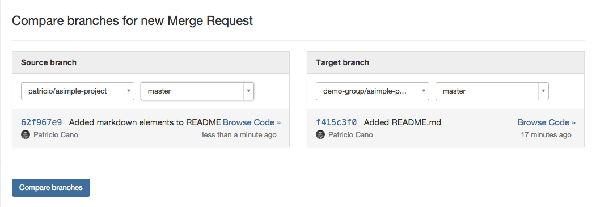

# Code forking workflow

Forking a project to your own namespace is useful if you have no write access to the project you want to contribute
to. If you do have write access or can request it we recommend working together in the same repository since it is simpler.
See our **[GitLab Flow](https://about.gitlab.com/2014/09/29/gitlab-flow/)** article for more information about using
branches to work together.

## Creating a fork

In order to create a fork of a project, all you need to do is click on the fork button located on the top right side
of the screen, close to the project's URL and right next to the stars button.

Once you do that you'll be presented with a screen where you can choose the namespace to fork to. Only namespaces
(groups and your own namespace) where you have write access to, will be shown. Click on the namespace to create your
fork there.

After the forking is done, you can start working on the newly created repository. There you will have full
[Owner](../permissions/permissions.md) access, so you can set it up as you please.

## Merging upstream

Once you are ready to send your code back to the main project, you need to create a merge request. Choose your forked
project's main branch as the source and the original project's main branch as the destination and create the merge request.

You can then assign the merge request to someone to have them review your changes. Upon pressing the 'Accept Merge Request'
button, your changes will be added to the repository and branch you're merging into.

