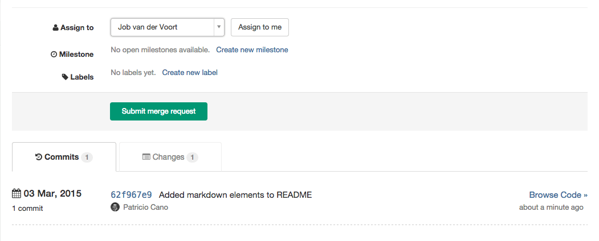

# Code forking workflow

Forking a project to your own namespace is useful if you have no write access to the project you want to contribute
to. If you do have write access, we recommend using the **[Code Branching Workflow](https://about.gitlab.com/2014/09/29/gitlab-flow/)**.

## Creating a fork

In order to create a fork of a project, all you need to do is click on the fork button located on the top right side
of the screen, close to the project's URL and right next to the stars button.

Once you do that you will see a screen where you can choose the namespace, to where you want to add the fork. This page
will contain the groups you have write access to. Choose one of the groups and the project will be added there.

After the forking is done, you can start working on the newly created repository. There you will have full Owner access,
so you can set it up as you please.

## Merging upstream

Once you are ready to send your code back to the main project, you need to create a Merge request. Choose your forked
project's main branch as the source and the original project's main branch as the destination and create the merge request.

You can then assign the Merge Request to someone so they can review your changes. After they have reviewed them, the will
be added to the main project, if maintainer chooses to do so.

