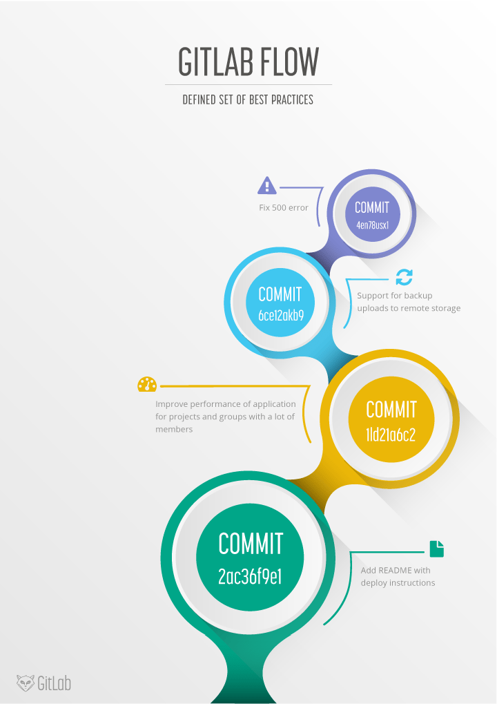
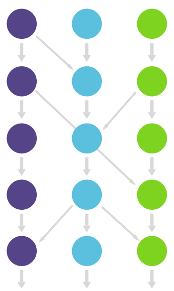
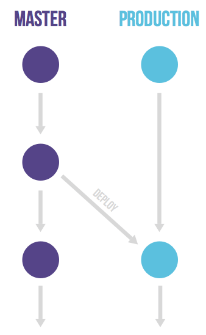
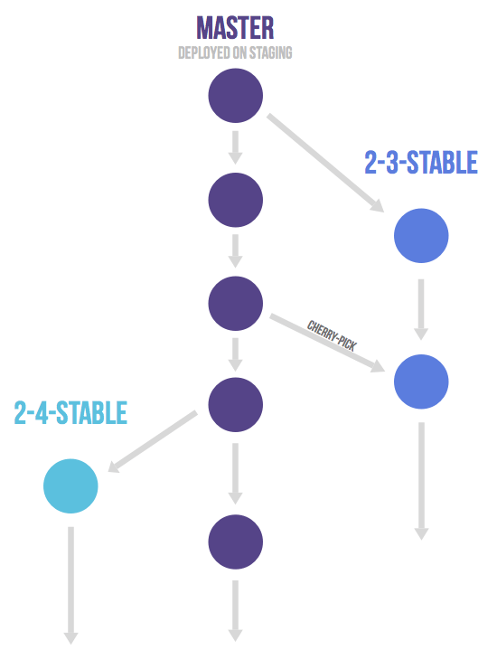
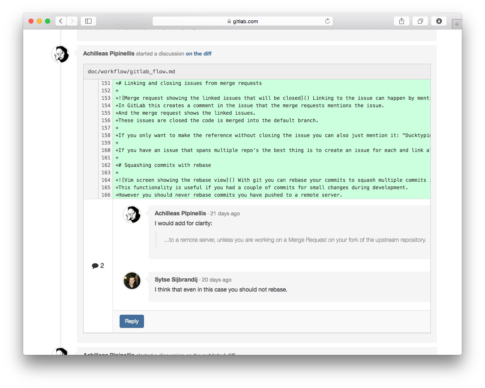
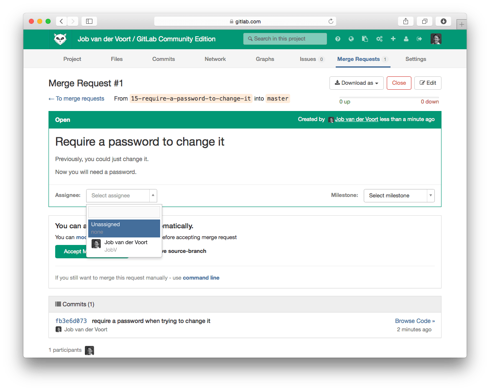
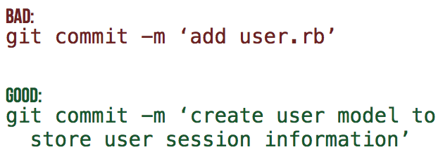
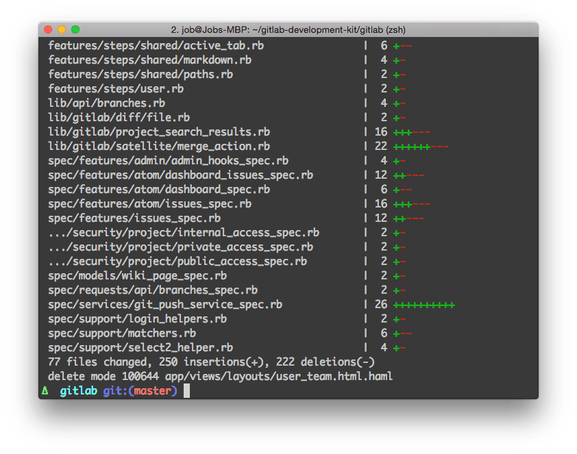

## Introduction

Version management with git makes branching and merging much easier than older versioning systems such as SVN.
This allows a wide variety of branching strategies and workflows.
Almost all of these are an improvement over the methods used before git.
But many organizations end up with a workflow that is not clearly defined, overly complex or not integrated with issue tracking systems.
Therefore we propose the GitLab flow as clearly defined set of best practices.
It combines [feature driven development](https://en.wikipedia.org/wiki/Feature-driven_development) and [feature branches](http://martinfowler.com/bliki/FeatureBranch.html) with issue tracking.

Organizations coming to git from other version control systems frequently find it hard to develop an effective workflow.
This article describes the GitLab flow that integrates the git workflow with an issue tracking system.
It offers a simple, transparent and effective way to work with git.

When converting to git you have to get used to the fact that there are three steps before a commit is shared with colleagues.
Most version control systems have only step, committing from the working copy to a shared server.
In git you add files from the working copy to the staging area. After that you commit them to the local repo.
The third step is pushing to a shared remote repository.
After getting used to these three steps the branching model becomes the challenge.

Since many organizations new to git have no conventions how to work with it, it can quickly become a mess.
The biggest problem they run into is that many long running branches that each contain part of the changes are around.
People have a hard time figuring out which branch they should develop on or deploy to production.
Frequently the reaction to this problem is to adopt a standardized pattern such as [git flow](http://nvie.com/posts/a-successful-git-branching-model/) and [GitHub flow](http://scottchacon.com/2011/08/31/github-flow.html).
We think there is still room for improvement and will detail a set of practices we call GitLab flow.

## Git flow and its problems

Git flow was one of the first proposals to use git branches and it has gotten a lot of attention.
It advocates a master branch and a separate develop branch as well as supporting branches for features, releases and hotfixes.
The development happens on the develop branch, moves to a release branch and is finally merged into the master branch.
Git flow is a well defined standard but its complexity introduces two problems.
The first problem is that developers must use the develop branch and not master, master is reserved for code that is released to production.
It is a convention to call your default branch master and to mostly branch from and merge to this.
Since most tools automatically make the master branch the default one and display that one by default it is annoying to have to switch to another one.
The second problem of git flow is the complexity introduced by the hotfix and release branches.
These branches can be a good idea for some organizations but are overkill for the vast majority of them.
Nowadays most organizations practice continuous delivery which means that your default branch can be deployed.
This means that hotfix and release branches can be prevented including all the ceremony they introduce.
An example of this ceremony is the merging back of release branches.
Though specialized tools do exist to solve this, they require documentation and add complexity.
Frequently developers make a mistake and for example changes are only merged into master and not into the develop branch.
The root cause of these errors is that git flow is too complex for most of the use cases.
And doing releases doesn't automatically mean also doing hotfixes.

## GitHub flow as a simpler alternative

In reaction to git flow a simpler alternative was detailed, [GitHub flow](https://guides.github.com/introduction/flow/index.html).
This flow has only feature branches and a master branch.
This is very simple and clean, many organizations have adopted it with great success.
Atlassian recommends [a similar strategy](http://blogs.atlassian.com/2014/01/simple-git-workflow-simple/) although they rebase feature branches.
Merging everything into the master branch and deploying often means you minimize the amount of code in 'inventory' which is in line with the lean and continuous delivery best practices.
But this flow still leaves a lot of questions unanswered regarding deployments, environments, releases and integrations with issues.
With GitLab flow we offer additional guidance for these questions.

## Production branch with GitLab flow

GitHub flow does assume you are able to deploy to production every time you merge a feature branch.
This is possible for SaaS applications but are many cases where this is not possible.
One would be a situation where you are not in control of the exact release moment, for example an iOS application that needs to pass App Store validation.
Another example is when you have deployment windows (workdays from 10am to 4pm when the operations team is at full capacity) but you also merge code at other times.
In these cases you can make a production branch that reflects the deployed code.
You can deploy a new version by merging in master to the production branch.
If you need to know what code is in production you can just checkout the production branch to see.
The approximate time of deployment is easily visible as the merge commit in the version control system.
This time is pretty accurate if you automatically deploy your production branch.
If you need a more exact time you can have your deployment script create a tag on each deployment.
This flow prevents the overhead of releasing, tagging and merging that is common to git flow.

## Environment branches with GitLab flow

It might be a good idea to have an environment that is automatically updated to the master branch.
Only in this case, the name of this environment might differ from the branch name.
Suppose you have a staging environment, a pre-production environment and a production environment.
In this case the master branch is deployed on staging. When someone wants to deploy to pre-production they create a merge request from the master branch to the pre-production branch.
And going live with code happens by merging the pre-production branch into the production branch.
This workflow where commits only flow downstream ensures that everything has been tested on all environments.
If you need to cherry-pick a commit with a hotfix it is common to develop it on a feature branch and merge it into master with a merge request, do not delete the feature branch.
If master is good to go (it should be if you a practicing [continuous delivery](http://martinfowler.com/bliki/ContinuousDelivery.html)) you then merge it to the other branches.
If this is not possible because more manual testing is required you can send merge requests from the feature branch to the downstream branches.
An 'extreme' version of environment branches are setting up an environment for each feature branch as done by [Teatro](https://teatro.io/).

## Release branches with GitLab flow

Only in case you need to release software to the outside world you need to work with release branches.
In this case, each branch contains a minor version (2-3-stable, 2-4-stable, etc.).
The stable branch uses master as a starting point and is created as late as possible.
By branching as late as possible you minimize the time you have to apply bug fixes to multiple branches.
After a release branch is announced, only serious bug fixes are included in the release branch.
If possible these bug fixes are first merged into master and then cherry-picked into the release branch.
This way you can't forget to cherry-pick them into master and encounter the same bug on subsequent releases.
This is called an 'upstream first' policy that is also practiced by [Google](https://www.chromium.org/chromium-os/chromiumos-design-docs/upstream-first) and [Red Hat](https://www.redhat.com/about/news/archive/2013/5/a-community-for-using-openstack-with-red-hat-rdo).
Every time a bug-fix is included in a release branch the patch version is raised (to comply with [Semantic Versioning](http://semver.org/)) by setting a new tag.
Some projects also have a stable branch that points to the same commit as the latest released branch.
In this flow it is not common to have a production branch (or git flow master branch).

## Merge/pull requests with GitLab flow

Merge or pull requests are created in a git management application and ask an assigned person to merge two branches.
Tools such as GitHub and Bitbucket choose the name pull request since the first manual action would be to pull the feature branch.
Tools such as GitLab and Gitorious choose the name merge request since that is the final action that is requested of the assignee.
In this article we'll refer to them as merge requests.

If you work on a feature branch for more than a few hours it is good to share the intermediate result with the rest of the team.
This can be done by creating a merge request without assigning it to anyone, instead you mention people in the description or a comment (/cc @mark @susan).
This means it is not ready to be merged but feedback is welcome.
Your team members can comment on the merge request in general or on specific lines with line comments.
The merge requests serves as a code review tool and no separate tools such as Gerrit and reviewboard should be needed.
If the review reveals shortcomings anyone can commit and push a fix.
Commonly the person to do this is the creator of the merge/pull request.
The diff in the merge/pull requests automatically updates when new commits are pushed on the branch.

When you feel comfortable with it to be merged you assign it to the person that knows most about the codebase you are changing and mention any other people you would like feedback from.
There is room for more feedback and after the assigned person feels comfortable with the result the branch is merged.
If the assigned person does not feel comfortable they can close the merge request without merging.

In GitLab it is common to protect the long-lived branches (e.g. the master branch) so that normal developers [can't modify these protected branches](http://doc.gitlab.com/ce/permissions/permissions.html).
So if you want to merge it into a protected branch you assign it to someone with master authorizations.

## Issues with GitLab flow

GitLab flow is a way to make the relation between the code and the issue tracker more transparent.

Any significant change to the code should start with an issue where the goal is described.
Having a reason for every code change is important to inform everyone on the team and to help people keep the scope of a feature branch small.
In GitLab each change to the codebase starts with an issue in the issue tracking system.
If there is no issue yet it should be created first provided there is significant work involved (more than 1 hour).
For many organizations this will be natural since the issue will have to be estimated for the sprint.
Issue titles should describe the desired state of the system, e.g. "As an administrator I want to remove users without receiving an error" instead of "Admin can't remove users.".

When you are ready to code you start a branch for the issue from the master branch.
The name of this branch should start with the issue number, for example '15-require-a-password-to-change-it'.

When you are done or want to discuss the code you open a merge request.
This is an online place to discuss the change and review the code.
Creating a branch is a manual action since you do not always want to merge a new branch you push, it could be a long-running environment or release branch.
If you create the merge request but do not assign it to anyone it is a 'work-in-process' merge request.
These are used to discuss the proposed implementation but are not ready for inclusion in the master branch yet.

When the author thinks the code is ready the merge request is assigned to reviewer.
The reviewer presses the merge button when they think the code is ready for inclusion in the master branch.
In this case the code is merged and a merge commit is generated that makes this event easily visible later on.
Merge requests always create a merge commit even when the commit could be added without one.
This merge strategy is called 'no fast-forward' in git.
After the merge the feature branch is deleted since it is no longer needed, in GitLab this deletion is an option when merging.

Suppose that a branch is merged but a problem occurs and the issue is reopened.
In this case it is no problem to reuse the same branch name since it was deleted when the branch was merged.
At any time there is at most one branch for every issue.
It is possible that one feature branch solves more than one issue.

## Linking and closing issues from merge requests

Linking to the issue can happen by mentioning them from commit messages (fixes #14, closes #67, etc.) or from the merge request description.
In GitLab this creates a comment in the issue that the merge requests mentions the issue.
And the merge request shows the linked issues.
These issues are closed once code is merged into the default branch.

If you only want to make the reference without closing the issue you can also just mention it: "Duck typing is preferred. #12".

If you have an issue that spans across multiple repositories, the best thing is to create an issue for each repository and link all issues to a parent issue.

## Squashing commits with rebase

With git you can use an interactive rebase (rebase -i) to squash multiple commits into one and reorder them.
This functionality is useful if you made a couple of commits for small changes during development and want to replace them with a single commit or if you want to make the order more logical.
However you should never rebase commits you have pushed to a remote server.
Somebody can have referred to the commits or cherry-picked them.
When you rebase you change the identifier (SHA-1) of the commit and this is confusing.
If you do that the same change will be known under multiple identifiers and this can cause much confusion.
If people already reviewed your code it will be hard for them to review only the improvements you made since then if you have rebased everything into one commit.

People are encouraged to commit often and to frequently push to the remote repository so other people are aware what everyone is working on.
This will lead to many commits per change which makes the history harder to understand.
But the advantages of having stable identifiers outweigh this drawback.
And to understand a change in context one can always look at the merge commit that groups all the commits together when the code is merged into the master branch.

After you merge multiple commits from a feature branch into the master branch this is harder to undo.
If you would have squashed all the commits into one you could have just reverted this commit but as we indicated you should not rebase commits after they are pushed.
Fortunately [reverting a merge made some time ago](https://git-scm.com/blog/2010/03/02/undoing-merges.html) can be done with git.
This however, requires having specific merge commits for the commits your want to revert.
If you revert a merge and you change your mind, revert the revert instead of merging again since git will not allow you to merge the code again otherwise.

Being able to revert a merge is a good reason always to create a merge commit when you merge manually with the `--no-ff` option.
Git management software will always create a merge commit when you accept a merge request.

## Do not order commits with rebase

With git you can also rebase your feature branch commits to order them after the commits on the master branch.
This prevents creating a merge commit when merging master into your feature branch and creates a nice linear history.
However, just like with squashing you should never rebase commits you have pushed to a remote server.
This makes it impossible to rebase work in progress that you already shared with your team which is something we recommend.
When using rebase to keep your feature branch updated you [need to resolve similar conflicts again and again](https://blogs.atlassian.com/2013/10/git-team-workflows-merge-or-rebase/).
You can reuse recorded resolutions (rerere) sometimes, but without rebasing you only have to solve the conflicts one time and you’re set.
There has to be a better way to avoid many merge commits.

The way to prevent creating many merge commits is to not frequently merge master into the feature branch.
We'll discuss the three reasons to merge in master: leveraging code, solving merge conflicts and long running branches.
If you need to leverage some code that was introduced in master after you created the feature branch you can sometimes solve this by just cherry-picking a commit.
If your feature branch has a merge conflict, creating a merge commit is a normal way of solving this.
You should aim to prevent merge conflicts where they are likely to occur.
One example is the CHANGELOG file where each significant change in the codebase is documented under a version header.
Instead of everyone adding their change at the bottom of the list for the current version it is better to randomly insert it in the current list for that version.
This it is likely that multiple feature branches that add to the CHANGELOG can be merged before a conflict occurs.
The last reason for creating merge commits is having long lived branches that you want to keep up to date with the latest state of the project.
Martin Fowler, in [his article about feature branches](http://martinfowler.com/bliki/FeatureBranch.html) talks about this Continuous Integration (CI).
At GitLab we are guilty of confusing CI with branch testing. Quoting Martin Fowler: "I've heard people say they are doing CI because they are running builds, perhaps using a CI server, on every branch with every commit.
That's continuous building, and a Good Thing, but there's no integration, so it's not CI.".
The solution to prevent many merge commits is to keep your feature branches short-lived, the vast majority should take less than one day of work.
If your feature branches commonly take more than a day of work, look into ways to create smaller units of work and/or use [feature toggles](http://martinfowler.com/bliki/FeatureToggle.html).
As for the long running branches that take more than one day there are two strategies.
In a CI strategy you can merge in master at the start of the day to prevent painful merges at a later time.
In a synchronization point strategy you only merge in from well defined points in time, for example a tagged release.
This strategy is [advocated by Linus Torvalds](https://www.mail-archive.com/dri-devel@lists.sourceforge.net/msg39091.html) because the state of the code at these points is better known.

In conclusion, we can say that you should try to prevent merge commits, but not eliminate them.
Your codebase should be clean but your history should represent what actually happened.
Developing software happen in small messy steps and it is OK to have your history reflect this.
You can use tools to view the network graphs of commits and understand the messy history that created your code.
If you rebase code the history is incorrect, and there is no way for tools to remedy this because they can't deal with changing commit identifiers.

## Voting on merge requests

It is common to voice approval or disapproval by using +1 or -1 emoticons.
In GitLab the +1 and -1 are aggregated and shown at the top of the merge request.
As a rule of thumb anything that doesn't have two times more +1's than -1's is suspect and should not be merged yet.

## Pushing and removing branches

We recommend that people push their feature branches frequently, even when they are not ready for review yet.
By doing this you prevent team members from accidentally starting to work on the same issue.
Of course this situation should already be prevented by assigning someone to the issue in the issue tracking software.
However sometimes one of the two parties forgets to assign someone in the issue tracking software.
After a branch is merged it should be removed from the source control software.
In GitLab and similar systems this is an option when merging.
This ensures that the branch overview in the repository management software shows only work in progress.
This also ensures that when someone reopens the issue a new branch with the same name can be used without problem.
When you reopen an issue you need to create a new merge request.

## Committing often and with the right message

We recommend to commit early and often.
Each time you have a functioning set of tests and code a commit can be made.
The advantage is that when an extension or refactor goes wrong it is easy to revert to a working version.
This is quite a change for programmers that used SVN before, they used to commit when their work was ready to share.
The trick is to use the merge/pull request with multiple commits when your work is ready to share.
The commit message should reflect your intention, not the contents of the commit.
The contents of the commit can be easily seen anyway, the question is why you did it.
An example of a good commit message is: "Combine templates to dry up the user views.".
Some words that are bad commit messages because they don't contain munch information are: change, improve and refactor.
The word fix or fixes is also a red flag, unless it comes after the commit sentence and references an issue number.
To see more information about the formatting of commit messages please see this great [blog post by Tim Pope](http://tbaggery.com/2008/04/19/a-note-about-git-commit-messages.html).

## Testing before merging

In old workflows the Continuous Integration (CI) server commonly ran tests on the master branch only.
Developers had to ensure their code did not break the master branch.
When using GitLab flow developers create their branches from this master branch so it is essential it is green.
Therefore each merge request must be tested before it is accepted.
CI software like Travis and GitLab CI show the build results right in the merge request itself to make this easy.
One drawback is that they are testing the feature branch itself and not the merged result.
What one can do to improve this is to test the merged result itself.
The problem is that the merge result changes every time something is merged into master.
Retesting on every commit to master is computationally expensive and means you are more frequently waiting for test results.
If there are no merge conflicts and the feature branches are short lived the risk is acceptable.
If there are merge conflicts you merge the master branch into the feature branch and the CI server will rerun the tests.
If you have long lived feature branches that last for more than a few days you should make your issues smaller.

## Merging in other code

When initiating a feature branch, always start with an up to date master to branch off from.
If you know beforehand that your work absolutely depends on another branch you can also branch from there.
If you need to merge in another branch after starting explain the reason in the merge commit.
If you have not pushed your commits to a shared location yet you can also rebase on master or another feature branch.
Do not merge in upstream if your code will work and merge cleanly without doing so, Linus even says that [you should never merge in upstream at random points, only at major releases](https://lwn.net/Articles/328438/).
Merging only when needed prevents creating merge commits in your feature branch that later end up littering the master history.

### References

- [Sketch file](https://www.dropbox.com/s/58dvsj5votbwrzv/git_flows.sketch?dl=0) with vectors of images in this article
- [Git Flow by Vincent Driessen](http://nvie.com/posts/a-successful-git-branching-model/)
