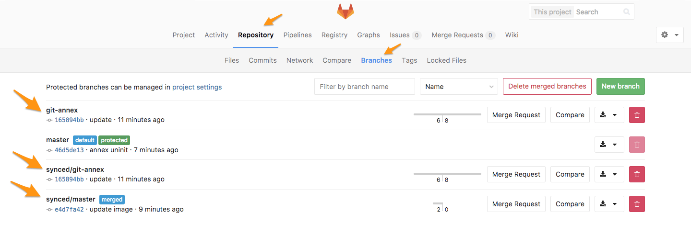

# Migration Guide from Git Annex to Git LFS

Both [Git Annex][] (**git-annex**) and [Git LFS][]
(**git-lfs**) are tools to manage large files in Git.

GitLab EE is deprecating
[support to **git-annex**][post-intro-annex] from version
8.17 on (released on 2017/02/22). It
[will be removed][issue-remove-annex] completely in
GitLab 9.0 (2017/03/22).

To understand the main differences between **git-annex**
ang **git-lfs**, read through this [overview][annex-vs-lfs].

## Configurations

To use [**git-annex** in GitLab EE][annex-ee], you had
first to install and enable it on your server and
in your [local environment][install-annex-local].
On GitLab.com, **git-annex** was enabled, and you had
only to install it locally.

### Enabling Annex

This step is only important to remind you how did
you enabled **git-annex**, so disabling it will become
more logical. Of course, you don't need to repeat
these steps.

Considering you have **git-annex** up and running in
both remote and local copies, to enable **git-annex** to
your project, initiate **git-annex** and sync your repo:

- Initiate **git-annex** in your repository:

    ```bash
    $ git annex init
    init ok
    (recording state in git...)
    ```
- Add the images you want to track to your e.g.,
`images` directory
- Track the large files, for example, the `images`
directory:

    ```bash
    $ git annex add images/*
    add images/01.png ok
    add images/02.png ok
    (recording state in git...)
    # commit and sync
    $ git commit -m "add tracked images"
    $ git annex sync --content
    ```

By doing so, **git-annex** would record the tracked files
in the `.git/config` file in your repository root.

You will also find a new directory at `.git/annex/`.

The files you assign to be tracked with **git-annex**
will not affect `.git/config` records. The files are
turned into symbolic links that point to data in
`.git/annex/objects/`.

The image file will contain the symbolic link, like this:

```
../.git/annex/objects/ZW/1k/SHA256E-s82701--6384039733b5035b559efd5a2e25a493ab6e09aabfd5162cc03f6f0ec238429d.png/SHA256E-s82701--6384039733b5035b559efd5a2e25a493ab6e09aabfd5162cc03f6f0ec238429d.png
```

Your files will be found in the branch `master`, but
you'll notice that there are more branches created by
the `annex sync` command.

Use `git annex info` to retrieve the information about
that repository.

### Disabling **git-annex**

Before changing anything, make sure you have a backup
of your repository first. There are a couple ways to
do that, but you can simply clone it to another local
path and push it to GitLab if you want a remote backup
as well.

Here you'll find a guide on
[how to back up a **git-annex** repository to an external hard drive][bkp-ext-drive].

To [stop using **git-annex**][uninit], you need to disable
**git-annex** first.

Make sure the [**git-annex** mode is `direct`][stackoverflow-1]:

```bash
$ git annex direct
commit
On branch master
Your branch is up-to-date with 'origin/master'.
nothing to commit, working tree clean
ok
direct images/01.png ok
direct images/02.png ok
direct  ok
```

Then, we run `git annex uninit`:


```bash
$ git annex uninit
unannex images/01.png ok
unannex images/02.png ok
Deleted branch git-annex (was 186d141).
```

It will unannex every file in the repository, leaving your repository with the original files.

To make these changes to be applied to the remote repo, we change the mode back to `indirect`:

```bash
$ git annex indirect
(merging origin/git-annex into git-annex...)
(recording state in git...)
commit  (recording state in git...)

ok
(recording state in git...)
[master cc5fd03] commit before switching to indirect mode
 2 files changed, 2 deletions(-)
 delete mode 120000 images/01.png
 delete mode 120000 images/02.png
ok
indirect  ok
ok
$
```

Now, we can add, commit, and push to reflect the
changes on the remote repo:

```bash
$ git add .
$ git status
On branch master
Your branch is ahead of 'origin/master' by 1 commit.
  (use "git push" to publish your local commits)
Changes to be committed:
  (use "git reset HEAD <file>..." to unstage)

  new file:   images/01.png
  new file:   images/02.png
$ git commit -m "annex uninit"
[master 46d5de1] annex uninit
 2 files changed, 0 insertions(+), 0 deletions(-)
 create mode 100644 images/01.png
 create mode 100644 images/02.png
$ git push origin master
```

For keeping your repo clean, let's remove all
**git-annex** related branches from your repository.

- On GitLab, navigate to your project's **Repository** > **Branches**

    

- Delete all branches created by **git-annex**: `git-annex`, and all under `synced/*`.

### Enabling Git LFS

Git LFS is enabled by default on all GitLab products
(GitLab CE, GitLab EE, GitLab.com), therefore, you
don't need to do anything in the server side.

First, let's make sure you have **git-lfs** installed
locally:

```bash
$ git lfs help
```

If the terminal doesn't prompt you with a full response
on **git-lfs** commands, [install LFS][install-lfs] first:

```bash
$ brew install git-lfs
```

[Enable **git-lfs**][lfs-track] for the group of files you
want to track with it. You can track specific files, all
files containing the same extension, or an entire
directory:

- Per file:

    ```bash
    git lfs track images/01.png
    ```

- Per extension:

    ```bash
    git lfs track *.png
    ```

- Per directory:

    ```bash
    git lfs track images/*
    ```

Example:

```bash
$ git lfs track images/*
Tracking images/01.png
Tracking images/02.png
$
```

Once you do that, run `git status` and you'll see
`.gitattributes` added to your repo. It collects all
file patterns that you chose to track via **git-lfs**.

To see **git-lfs** working, look at the project's size (in
bites), update one of your files, and push a change
to the remote.

- Repo size: 492 KB
- Add, commit, and push
- Repo size: 492 KB

Though the image has 32KB, the repo remains the same
size after pushing it again.

[annex-ee]: https://docs.gitlab.com/ee/workflow/git_annex.html
[annex-vs-lfs]: https://workingconcept.com/blog/git-annex-vs-git-lfs
[bkp-ext-drive]: https://www.thomas-krenn.com/en/wiki/Git-annex_Repository_on_an_External_Hard_Drive
[Git Annex]: http://git-annex.branchable.com/
[Git LFS]: https://git-lfs.github.com/
[install-annex-local]: https://git-annex.branchable.com/install/
[install-lfs]: https://git-lfs.github.com/
[issue-remove-annex]: https://gitlab.com/gitlab-org/gitlab-ee/issues/1648
[lfs-track]: https://about.gitlab.com/2017/01/30/getting-started-with-git-lfs-tutorial/#tracking-files-with-lfs
[post-intro-annex]: https://about.gitlab.com/2015/02/17/gitlab-annex-solves-the-problem-of-versioning-large-binaries-with-git/
[stackoverflow-1]: http://stackoverflow.com/questions/24447047/remove-git-annex-repository-from-file-tree
[uninit]: https://git-annex.branchable.com/git-annex-uninit/
