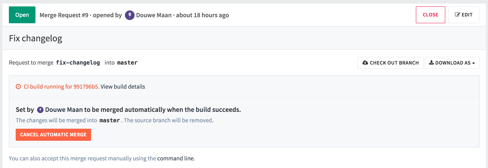

# Merge When Build Succeeds

When reviewing a merge request that looks ready to merge but still has one or more CI builds running, you can set it to be merged automatically when the build succeeds. This way, you don't have to wait for the build to finish and remember to merge the merge request then.

When you hit the "Merge When Build Succeeds" button, the status of the Merge Request will be updated to represent the impending merge. If you cannot wait for the build to succeed and want to build immediately, this option is available in the dropdown menu on the right of the main button.

Both team developers and the author of the merge request have the option to cancel the automatic merge when they find a reason it shouldn't be merged after all.

When the build succeeds, the merge request will automatically be merged. When the build fails, the author gets a chance to retry any failed builds, or to push new commits to fix the failure.

When the builds are retried and succeed on the second try, the merge request will automatically be merged after all. When the merge request is updated with new commits, the automatic merge is automatically canceled to allow the new changes to be reviewed.
