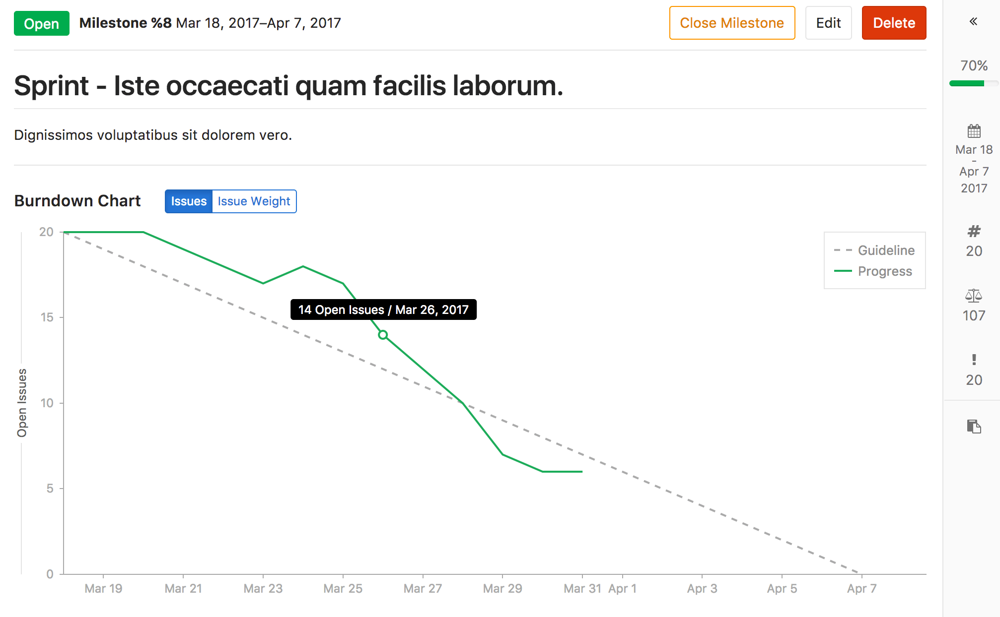

# Milestones

Milestones allow you to organize issues and merge requests into a cohesive group, optionally setting a due date.
A common use is keeping track of an upcoming software version. Milestones are created per-project.

## Groups and milestones

You can create a milestone for several projects in the same group simultaneously.
On the group's milestones page, you will be able to see the status of that milestone across all of the selected projects.

## Special milestone filters

In addition to the milestones that exist in the project or group, there are some
special options available when filtering by milestone:

* **No Milestone** - only show issues or merge requests without a milestone.
* **Upcoming** - show issues or merge request that belong to the next open
  milestone with a due date, by project. (For example: if project A has
  milestone v1 due in three days, and project B has milestone v2 due in a week,
  then this will show issues or merge requests from milestone v1 in project A
  and milestone v2 in project B.)
* **Started** - show issues or merge requests from any milestone with a start
  date less than today. Note that this can return results from several
  milestones in the same project.

## Burndown charts

> [Introduced][ee-1540] in GitLab Enterprise Edition 9.1 and is available for
  [Enterprise Edition Starter][ee] users.

A burndown chart is available for every project milestone that has a set start
date and a set due date and is located on the project's milestone page.

It indicates the project's progress throughout that milestone (for issues that
have that milestone assigned to it). In particular, it shows how many issues
were or are still open for a given day in the milestone period. Since GitLab
only tracks when an issue was last closed (and not its full history), the chart
assumes that issue was open on days prior to that date. Reopened issues are
considered as open on one day after they were closed.

The burndown chart can also be toggled to display the cumulative open issue
weight for a given day. When using this feature, make sure your weights have
been properly assigned, since an open issue with no weight adds zero to the
cumulative value.

Closed or reopened issues prior to GitLab 9.1 version won't have a `closed_at`
value, so the burndown chart considers it as closed on the milestone `start_date`.
In that case, a warning will be displayed.

[ee-1540]: https://gitlab.com/gitlab-org/gitlab-ee/merge_requests/1540
[ee]: https://about.gitlab.com/gitlab-ee
