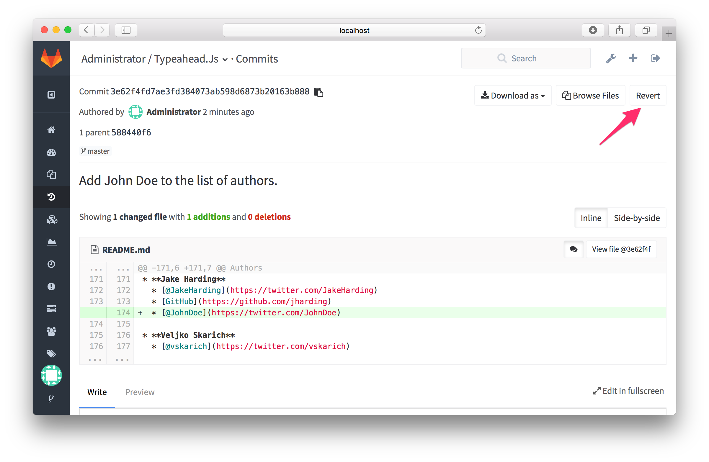
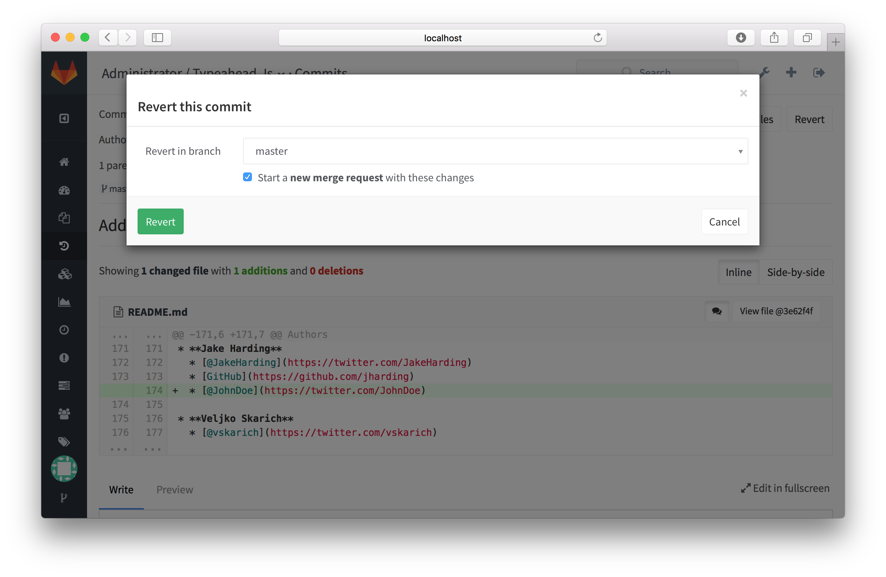

# Reverting changes

The new `Revert` button allows you to revert any changes introduced by a Commit or a Merge Request.

## Reverting a Merge Request

After the Merge Request has been merged, a `Revert` button will be available to revert the changes introduced by that Merge Request:


You can revert the changes directly into the selected branch or you can opt to create a new Merge Request with the revert changes:


After the Merge Request has been reverted, the `Revert` button will not be available anymore.

It's important to mention that this new button will be only available for Merge Requests created since the **8.5** version. However you can still revert a Merge by reverting the merge commit from the list of Commits page.

## Reverting a Commit

You can revert a Commit from the Commit detail page:



In the same way like reverting a Merge Request you can opt to revert the changes directly into the target branch or create a new Merge Request to revert the changes:



After the Commit has been reverted, the `Revert` button will not be available anymore.

Please note that when reverting merge commits, the mainline will allways be the first parent, if you want to use a different mainline then you need to do that from the command line, here is a quick sample:

```
# Revert a merge commit using the second parent as the mainline
git revert -m 2 commit_hash
```
