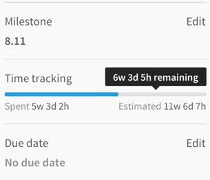
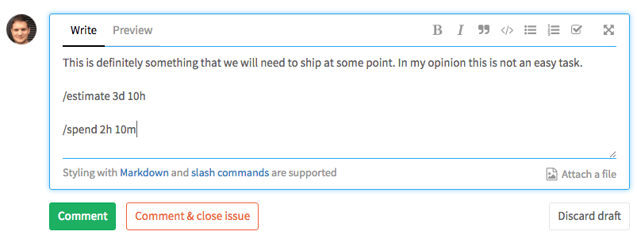

# Time Tracking

> Introduced in GitLab 8.14 as beta. This Product is free while in beta.
After the beta period, a new License key will need to be issued to use it.

Time Tracking lets teams stack their project estimates against their time spent.

## Overview

Time Tracking lets you:
* record the time spent working on an issue or a merge request,
* add an estimate of the amount of time needed to complete an issue or a merge
request.

You don't have to indicate an estimate to enter the time spent, and vice versa.

Data about time tracking is shown on the issue/merge request sidebar, as shown
below.

## How to enter data

Time Tracking uses two slash [commands] that are available with this new
feature: `/spend` and `/estimate`.

Slash commands can be used in the body of an issue or a merge request, but also
in a comment in both an issue or a merge request.

Below is an example of how you can use those new slash commands inside a comment.

Adding time entries (time spent or estimates) is limited to project members.

### Estimates

To enter an estimate, write `/estimate`, followed by the time. For example, if
you need to enter an estimate of 3 days, 5 hours and 10 minutes, you would write
`/estimate 3d 5h 10m`. Time units that we support are listed at the bottom of
this help page.

Every time you enter a new time estimate, any previous time estimates will be
overridden by this new value. There should only be one valid estimate in an
issue or a merge request.

To remove an estimation entirely, use `/remove_estimation`.

### Time spent

To enter a time spent, use `/spend 3d 5h 10m`.

Every new time spent entry will be added to the current total time spent for the
issue or the merge request.

You can remove time by entering a negative amount: `/spend -3d` will remove 3
days from the total time spent. You can't go below 0 minutes of time spent,
so GitLab will automatically reset the time spent if you remove a larger amount
of time compared to the time that was entered already.

To remove all the time spent at once, use `/remove_time_spent`.

## Configuration

The following time units are available:
* weeks (w)
* days (d)
* hours (h)
* minutes (m)

Default conversion rates are
* 1 week = 5 days,
* 1 day = 8 hours.

Other interesting links:

- [Time Tracking landing page on about.gitlab.com][landing]

[landing]: https://about.gitlab.com/features/time-tracking
[commands]: ../user/project/slash_commands.md
